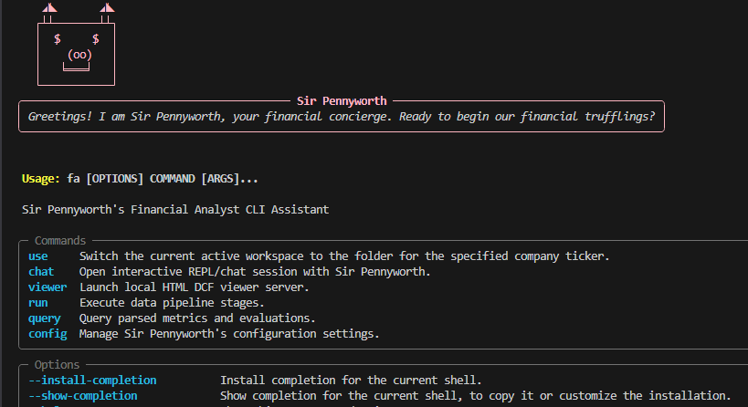
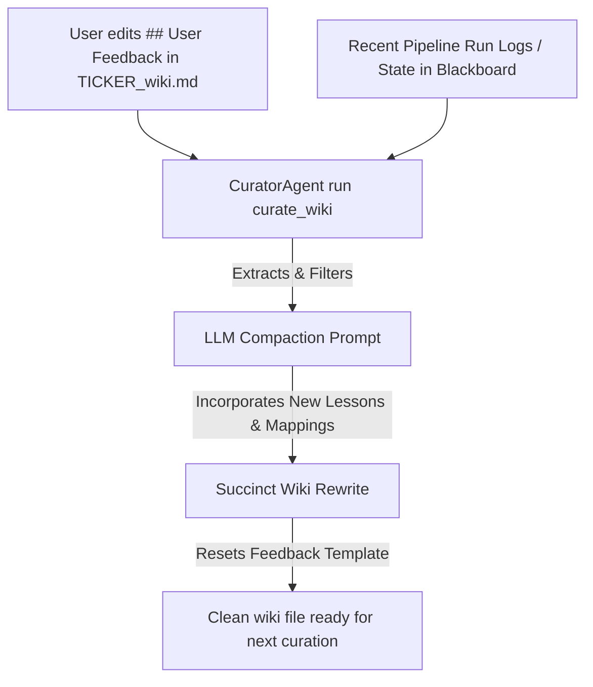
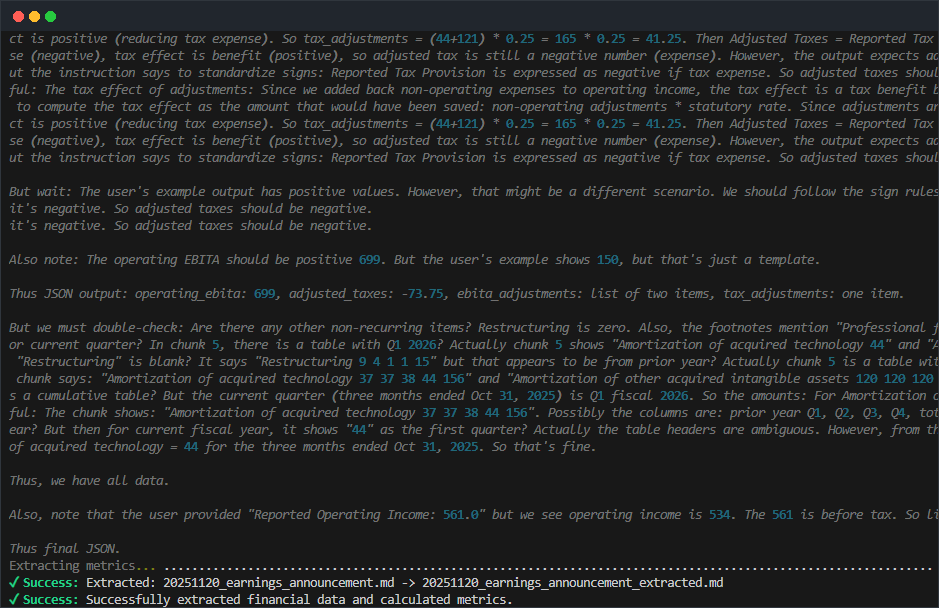

# Financial Analyst CLI (fa)

> [!NOTE]
> This is a personal project designed for automating high-quality financial analysis, qualitative assessments, and valuation modeling, powered by LLMs. It acts as a CLI orchestrator inspired by and built around the concepts in [financial-analyst-skills](https://github.com/Ruinius/financial-analyst-skills).

The interface is hosted by **Sir Pennyworth**, a greedy financial analyst pig with dollar-sign eyes who guides you through configuration, analyses, and hunting for maximum returns.

```text
    ◢◣       ◢◣   <-- Ears
   ┌┴┴───────┴┴┐
   │  $     $  │   <-- Dollar sign eyes (greedy)
   │    (oo)   │   <-- Snout
   │   ╘═══╛   │
   └───────────┘
```

<p align="center">
  
  <br>
  <em>Screenshot 1: The Sir Pennyworth interactive CLI help screen showing global options and available subcommands.</em>
</p>


---

## Why a Financial Analyst CLI?

While a layperson or chatbot might assume that financial analysis is completely deterministic, anyone who has tried to automate it knows this is far from the truth:

- **Inconsistent Reporting**: Every company formats and reports their financial statements differently.
- **Sign Ambiguity**: Numbers in financial tables are inconsistently expressed as positive or negative depending on the specific filing's layout and context.
- **Judgment & Context**: Isolating non-operating adjustments, interpreting ambiguous line items, and extracting footnotes require context, interpretation, and judgment.

While this doesn't require the open-ended reasoning level of a software engineering coding agent, standard static scripts and regexes simply cannot handle this variability. This complexity makes financial analysis the perfect candidate for an agentic AI CLI tool that blends LLM-based reasoning, structured validation schemas, and deterministic mathematical calculations.

---

## Self-Learning & Self-Healing Architecture

To prevent memory loss, avoid repeating errors, and accommodate the highly company-specific formatting of financial filings without complex remote databases, `fa` implements an in-workspace **Self-Learning & Self-Healing** architecture centered around the temporal blackboard:



### 1. Workspace-Local Learning & State
Instead of separate local learning markdown files, all run-to-run learnings and settings are consolidated into the structured Pydantic blackboard state:
- `workspace_state.json`: The single source of truth blackboard containing fanned-in extracted financials, longitudinal trends, DCF assumptions, and run-to-run agent learnings (`company_data.learnings`).
- `[TICKER]_wiki.md`: Curated, robustly written qualitative perspectives (Bull & Bear views). It also contains a `## User Feedback` header where users can write custom feedback to override assumptions, provide adjustments, or feed new qualitative guides to the system.

### 2. The Learning & Curation Loops
- **Learning Agent**: Automatically runs during execution to compile success/avoid logs and execution turn metrics (total runs, average turns, last turns) directly into the blackboard (`company_data.learnings`).
- **Curator Agent**: Runs on user request (`fa run curate_wiki`) to digest fanned-in blackboard data and user feedback from `[TICKER]_wiki.md`. It extracts feedback, refines Bull/Bear views via LLM synthesis, rewrites the wiki, and resets the feedback section.

### 3. Self-Healing in Action
When sub-agents execute subsequent runs, they read these localized learnings from the blackboard first. If a previous run encountered a parsing collision, a mismatched operating/non-operating row, or custom share adjustments, the agent automatically adapts using the saved lessons, "healing" its extraction and modeling pipeline without code changes.

---

## A Personal Growth Journey

This project is a milestone in my personal developer and AI alignment journey:

- **January 2026 — [Tiger-Cafe](https://github.com/Ruinius/tiger-cafe)**: I started by building a modern web application, diving deep into React, FastAPI, and full-stack development.
- **March 2026 — [Financial Analyst Skills](https://github.com/Ruinius/financial-analyst-skills)**: I transitioned into AI agent design, mapping out high-quality financial analysis concepts and domain-specific skills.
- **June 2026 — Financial Analyst CLI**: Now, I'm building this robust CLI workspace (`fa`) to merge structured agentic pipelines, local developer environments, and high-performance Rust calculations.

I am constantly learning and growing. I am incredibly grateful for any comments, feedback, or outreach—please feel free to open issues, start discussions, or connect!

---

## Project Status & Roadmap

* **Completed**: Finished editing the `ingest`, `extract`, and `analyze` stages with a focus on financial statements.
* **Next Step**: Build and refine the `model` and `viewer` stages, which should be much easier.
* **Short-Term Goal**: Work on scheduling and concurrency to make this system fully autonomous.
  * **Autonomous Final State**: Each quarter, the AI agent will run autonomously to ingest the latest financial statements and whatever the user feeds into the ingestion folder. The latest financial model and perspective will then be automatically generated and made available for review.
* **Far-Future Goal**: Build a portfolio builder and evolver with a strong value investing and slow investing perspective.

---

## Table of Contents

- [Why a Financial Analyst CLI?](#why-a-financial-analyst-cli)
- [Self-Learning & Self-Healing Architecture](#self-learning--self-healing-architecture)
- [A Personal Growth Journey](#a-personal-growth-journey)
- [Project Status & Roadmap](#project-status--roadmap)
- [Core Features](#core-features)
- [Installation & Setup](#installation--setup)
- [First-Time Configuration](#first-time-configuration)
- [Workspace Directory Structure](#workspace-directory-structure)
- [Command Line Interface (CLI) Reference](#command-line-interface-cli-reference)
  - [fa run](#1-fa-run-pipeline-orchestration)
  - [fa chat](#2-fa-chat-interactive-analyst-shell)
  - [fa query](#3-fa-query-data-display)
  - [fa use](#4-fa-use-workspace-switching)
  - [fa viewer](#5-fa-viewer-interactive-dcf-viewer)
  - [fa config](#6-fa-config-settings-management)
- [Architecture](#architecture)
- [License](#license)

---

## Core Features

1. **Structured Ingestion & Parsing**: Automated retrieval of filings (10-K, 10-Q, 20-F) from SEC EDGAR, layout-preserved markdown parsing, duplicate hashing, and smart LLM-driven date/quarter identification.
2. **Auditable Metric Extraction**: Extract Balance Sheet and Income Statement line items. Every data point is tagged with trace metadata (`source_file`, `chunk_id`, `exact_snippet`) for absolute auditing.
3. **Hybrid Python-Rust Engine**: Perform valuation modeling and multi-scenario sensitivity calculations in Rust via PyO3 bindings, with standard pipeline calculations (EBITA, Invested Capital, Tax Rates, and ROIC) executed directly in Python.
4. **Self-Learning LLMWiki**: Centralized ticker wiki and stage-specific learning registers that automatically consolidate, refine, and compact lessons and user feedback after each agent run.
5. **Interactive REPL / Analyst Shell (`fa chat`)**: Talk directly to Sir Pennyworth. Probe extracted financial metrics, execute custom math formulas in a sandboxed execution environment, and audit statements.
6. **Zero-Dependency DCF Viewer**: Start a local viewer server to dynamically tune DCF assumptions and save custom scenarios back to the workspace.
7. **Native Tool Use & Reusable Agent Loop**: Expose standard python functions as native tools to Gemini (`GeminiChatSession`) with a centralized executor loop (`AgentExecutor`) and an emulated fallback translation layer (`SimulatedChatSession`) for DeepSeek and OpenRouter models.

---

## Installation & Setup

This project uses a hybrid architecture consisting of a Python CLI and an optional compiled Rust computation core for sensitivity modeling.

### Prerequisites

1. **Python**: Python >= 3.14 (recommend managing via `uv`).
2. **uv**: This project uses `uv` for package management. Install it via instructions on [astral.sh/uv](https://astral.sh/uv).
3. **Rust Toolchain (Optional)**: To compile the Rust core modules for sensitivity modeling, you must have Rust and `cargo` installed (via [rustup.rs](https://rustup.rs/)).

### Environment Initialization

Clone this repository and run the following in your shell:

```powershell
# Create a virtual environment and sync dependencies
uv venv
.venv\Scripts\activate
uv sync

# Setup pre-commit linting and checks
uv run pre-commit install

# Run the project entry point
uv run python main.py
```

#### Optional: Sensitivity Modeling Rust Engine
The CLI runs out-of-the-box in pure Python. However, for running multi-scenario sensitivity modeling, you can optionally build the Rust extension module:

```powershell
# Compile the Rust extension module using maturin
uv run maturin develop
```

---

## First-Time Configuration

When you execute `fa` for the first time, Sir Pennyworth guides you through an interactive configuration setup. The configuration settings are saved locally to a `.env` file in the project root:

1. **User Identity**: Full name, email, and project name (crucial for declaring SEC EDGAR user-agent headers).
2. **LLM API Credentials**: Select your API provider (`openrouter`, `gemini`, or `deepseek`) and input the corresponding API key.
3. **Model Selection**: Select your preferred models for each provider (saved in `.env` as `GEMINI_MODEL`, `OPENROUTER_MODEL`, and `DEEPSEEK_MODEL`). The active text model ID automatically syncs depending on your selected provider.
4. **Workspace Path**: Specify a directory where company analyses will be run.

---

## Workspace Directory Structure

Setting up a workspace for a company ticker (e.g., `AAPL` or `MSFT`) initializes the following directory structure:

- **`1_ingest_data/`**: Raw documents (10-Ks, 10-Qs, earnings transcripts, analyst reports, press releases, etc.).
- **`2_parsed_data/`**: Markdown conversions of raw files (`YYYYMMDD_filetype.md`) and a `parsed_data.csv` index.
- **`3_archived_data/`**: Archived original files.
- **`9_scenario_model_json/`**: Structured JSON scenario models populated by overrides in the HTML DCF viewer.
- **`workspace_state.json`**: The single source of truth blackboard containing extracted statements, metrics, longitudinal summaries, DCF calculations, and run-to-run learnings.
- **`[TICKER]_wiki.md`**: Centralized wiki containing qualitative bull/bear views and user feedback overrides.

_Note: The subdirectories `4_extracted_data/`, `5_historical_analysis/`, `6_financial_model/`, and `7_historical_model_json/` are deprecated and removed, as their contents are now consolidated directly into the blackboard state (`workspace_state.json`)._

---

## Command Line Interface (CLI) Reference

### 1. `fa run` (Pipeline Orchestration)

Execute sequentially structured pipeline steps:

```powershell
# Fetch filings from SEC EDGAR
uv run fa run edgar AAPL --years 5

# Parse and chunk ingested raw files
uv run fa run ingest

# Extract financial statements and audit details
uv run fa run extract

# Synthesize multi-period metrics and qualitative trends
uv run fa run analyze

# Generate DCF model projections
uv run fa run model
```

<p align="center">
  
  <br>
  <em>Screenshot 2: Step-by-step pipeline execution output showing ingest, extraction, and mathematical modeling tasks.</em>
</p>


### 2. `fa chat` (Interactive Analyst Shell)

Start an interactive shell with Sir Pennyworth to ask questions, run calculations with a sandboxed Python solver, and examine financial metrics:

```powershell
uv run fa chat AAPL
```

### 3. `fa query` (Data Display)

Query analysis tables, qualitative assessments, and trace audit trails:

```powershell
# Show summary profile and historical financial statement metrics (with console sparklines)
uv run fa query summary AAPL

# Show qualitative assessments
uv run fa query assessment AAPL

# Show WACC inputs, projected cash flows, and intrinsic values
uv run fa query valuation AAPL

# Trace the exact raw file provenance/source text of a metric
uv run fa query trace AAPL Revenue 2025
```

### 4. `fa use` (Workspace Switching)

Switch the active workspace directory dynamically:

```powershell
uv run fa use AAPL
```

### 5. `fa viewer` (Interactive DCF Viewer)

Start the local web server to launch the zero-dependency interactive HTML model viewer:

```powershell
uv run fa viewer --port 3000 --host 127.0.0.1
```

### 6. `fa config` (Settings Management)

Initialize or display active configuration properties:

```powershell
# Interactively update your configurations and initialize directories
uv run fa config init

# Display current configuration profile
uv run fa config show

# Directly set provider, keys, or model preferences without the interactive wizard
uv run fa config set --provider gemini --gemini-model gemini-3-flash-preview
```

---

## Repository Structure & Architecture

The codebase is organized as a hybrid Python-Rust application:

* **`src/`**: Contains the active application source code, including sub-commands (`cli/`), execution agent stages (`agents/`), external API clients and sandboxed execution tools (`services/`), PyO3 Rust bindings (`rust_core/`), accounting classification dictionaries (`resources/`), and console/file utilities (`utils/`).
* **`tmp/`**: Dedicated local directory for temporary developer logs, scratchpads, and execution scripts.
* **`docs/`**: Full project specification, requirements, and design documents.
* **`tests/`**: Complete unit, E2E, and regression evaluation suite.
* **`.jules/`**: Vulnerability post-mortems and performance learnings (e.g., file I/O bottleneck and local viewer path traversal prevention).
* **`AGENTS.md`**: Architectural patterns, module boundaries, and documentation standards.

For deeper details on modular clients, Pydantic validation structures, the central dictionary, and core design decisions, refer to the [System Architecture Document](docs/architecture.md) and the agent guidelines in [AGENTS.md](AGENTS.md).

---

## License

This project is licensed under the MIT License - see the [LICENSE](LICENSE) file for details.
