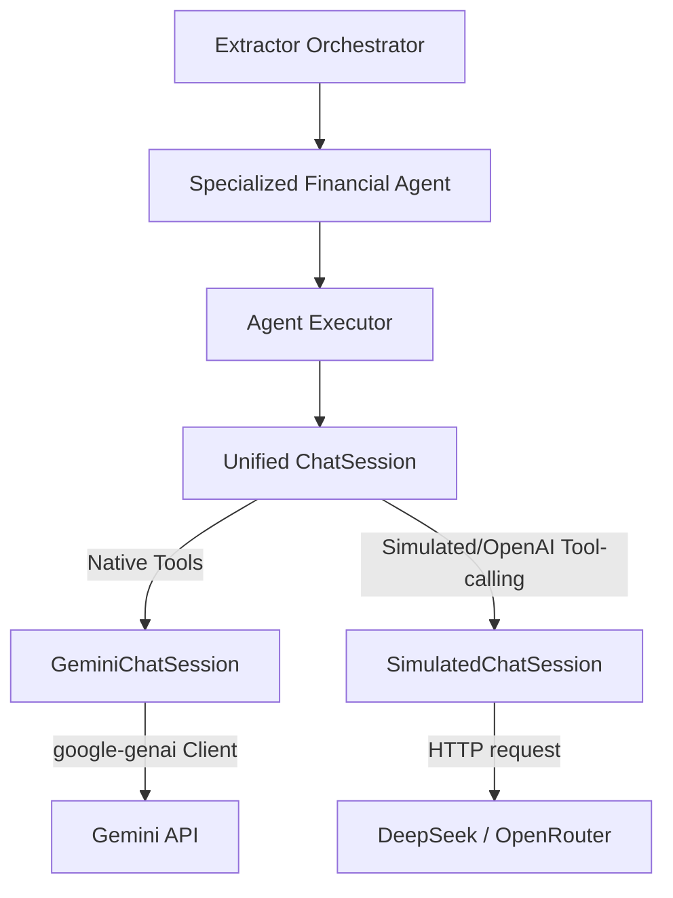

# Agentic Refactoring: Native Function Calling and Reusable Agent Loop Spec

This document details the architectural plan to refactor the multi-agent extraction system in `financial-analyst-cli`.

The goal is to leverage Google's native Gemini API capabilities (specifically **Native Function Calling / Tool Use** and **Native Chat Sessions**) to eliminate fragile text-based JSON tool invocation parsing, resolve turn-budget limitations, and simplify agent implementations.

---

## 1. Context & Motivation

Under the current architecture, extraction agents (e.g., Balance Sheet, Income Statement, Operating EBITA) simulate tool-use loops by:
1. Building a manual message list in memory.
2. Formatting and serializing the message history into a single flat string using role delimiters (`--- USER ---`, `--- ASSISTANT ---`).
3. Generating a text completion from the LLM, prompting it to return a custom JSON schema wrapped in markdown text.
4. Parsing the text using `extract_json_from_text` and regex to find the desired tool and arguments.
5. Invoking the tool and repeating.

### The Problem
When using Gemini models (e.g., Gemini 3.5 Flash or Gemini 1.5 Flash):
* Minor markdown or JSON formatting discrepancies force the agent into multi-turn correction loops.
* Because the agents are restricted to a hard turn limit (typically 10 turns for financials, 4 turns for adjustments), they quickly run out of turn budget.
* On Turn 9, the orchestrator injects a high-priority warning (`CRITICAL: This is your final turn... You must call the 'finalize' tool immediately`).
* This hijacks Gemini's reasoning, forcing it to finalize incomplete or invalid extractions (e.g., mismatched markdown tables) instead of correcting them.

---

## 2. Refactoring Architecture

We will introduce a clean separation between **Tool Registry**, **Agent Execution Loops**, and **Model APIs** (both native Gemini tool calling and emulated text-based tool calling).



### Key Refactoring Pillars

### A. Exposing Native Tools in `llm_client.py`
We will rewrite the `ChatSession` abstraction to natively accept Python callables (tools) and output structured function call requests:

* **GeminiChatSession:** Will pass tools directly to `client.chats.create` configuration (`config.tools`). It will map Gemini `function_calls` to executed python callables and return the results back via `Part.from_function_response`.
* **SimulatedChatSession:** Will serve as a fallback for OpenAI-compatible endpoints (DeepSeek, OpenRouter) or local mocks. It will automatically construct prompt instructions from the tools' docstrings/types, parse the JSON, execute the tool, and append the results to the chat history.

### B. Introducing a Reusable `AgentExecutor`
To completely eliminate duplicate turn loops, JSON regex matching, and boilerplate code across `balance_sheet_agent.py`, `income_statement_agent.py`, `ebita_agent.py`, etc., we will extract this logic into `src/agents/agent_executor.py`:

```python
# Conceptual signature of the centralized loop
def run_agent_loop(
    client: LLMClient,
    system_prompt: str,
    initial_prompt: str,
    tools: list[callable],
    max_turns: int = 10
) -> dict:
    """
    Executes a structured turn loop natively using LLM client tools.
    Handles function dispatching, limits tracking, and returns final results.
    """
```

---

## 3. Implementation Details

### A. Modifying `src/services/llm_client.py`
Expose tools and handle functional inputs cleanly:

```python
class ChatSession(ABC):
    @abstractmethod
    def send_message(self, message: str, tool_responses: list = None) -> Union[str, list]:
        """
        Sends a message to the chat session.
        If tool_responses is provided, sends the tool results to the assistant.
        Returns a string (text reply) or a list of tool call requests.
        """
        pass
```

For `GeminiChatSession`, tool responses are passed as function response parts:
```python
def send_message(self, message: str, tool_responses: list = None) -> Union[str, list]:
    from google.genai import types

    if tool_responses:
        # Construct the response parts mapping output values
        parts = [
            types.Part.from_function_response(
                name=r["name"],
                response={"result": str(r["content"])}
            )
            for r in tool_responses
        ]
        response = self.chat.send_message(parts)
    else:
        response = self.chat.send_message(message)

    # Check if the model demands further tool calls
    if response.function_calls:
        return response.function_calls
    return response.text or ""
```

### B. Refactoring Specialized Extraction Agents
Let's see the comparison of [balance_sheet_agent.py](file:///f:/AIML%20projects/financial-analyst-cli/src/agents/extractor_agents/extractor_financials_agents/balance_sheet_agent.py) before and after refactoring:

#### Before Refactoring:
* Duplicate code parsing JSON using regex.
* Manual implementation of `max_turns` loops.
* Rigid and verbose text interpolation for state management.

#### After Refactoring:
```python
# in src/agents/extractor_agents/extractor_financials_agents/balance_sheet_agent.py
from src.agents.agent_executor import run_agent_loop

def run_balance_sheet_agent(
    file_path: Path,
    content: str,
    sorted_chunk_ids: list,
    extractor,
    target_output_path: Path,
    is_quarterly: bool = True,
) -> None:
    # 1. Define tools as nested functions (which automatically capture state)
    def find_keyword_contexts(keywords: list, window: int = 200) -> str:
        """Search the parsed document for specific keywords."""
        ...

    def get_chunk_by_id(chunk_id: int) -> str:
        """Retrieve the contents of a specific chunk by its ID."""
        ...

    def append_markdown(text: str) -> str:
        """Append a markdown statement table to the target output file."""
        ...

    def check_balance_sheet_quality() -> str:
        """Verify the quality of the currently extracted balance sheet."""
        ...

    # 2. Run the standardized agent loop
    run_agent_loop(
        client=extractor.llm,
        system_prompt=SYSTEM_PROMPT,
        initial_prompt=INITIAL_PROMPT,
        tools=[find_keyword_contexts, get_chunk_by_id, append_markdown, check_balance_sheet_quality],
        max_turns=10
    )
```

---

## 4. DeepSeek & OpenRouter Compatibility (Simulated Tool Use)

To ensure that OpenRouter and DeepSeek models continue to function perfectly without any changes to their backend configurations, `SimulatedChatSession` will implement an **Emulated Tool Translation Layer**.

### How Compatibility is Guaranteed:
1. **Dynamic Tool Schema Ingestion:**
   * When `create_chat(..., tools)` is called on `OpenAICompatibleClient` (which instantiates `SimulatedChatSession`), the session parses the Python tool callables.
   * It inspects function docstrings and standard type hints to automatically build a clean text definition of the tools.
2. **System Prompt Injection:**
   * The generated text definitions are dynamically appended to the initial system prompt during simulation.
   * The injected instructions prompt the model to return its tool choice using a consistent JSON schema (matching the model's expected style).
3. **Execution Loop Unification:**
   * When `SimulatedChatSession.send_message` receives a text response containing the tool call, it parses the JSON block using `extract_json_from_text` and returns a list of native-like function call objects.
   * This ensures the centralized `run_agent_loop` receives the exact same payload interface, whether it's executing on top of native Gemini tool calling or simulated OpenRouter/DeepSeek sessions.

```python
# Conceptual fallback implementation in SimulatedChatSession
class SimulatedChatSession(ChatSession):
    def __init__(self, client, system_prompt, tools, model, temperature):
        self.client = client
        self.messages = []
        self.tools = tools or []

        # Build text description of tools
        if tools:
            tool_descriptions = "\n".join([
                f"- '{func.__name__}': {func.__doc__}"
                for func in tools
            ])
            system_prompt += f"\n\nAvailable tools:\n{tool_descriptions}\nRespond in JSON format."

        self.messages.append({"role": "system", "content": system_prompt})

    def send_message(self, message: str, tool_responses: list = None) -> Union[str, list]:
        if tool_responses:
            # Format the output context to simulate tool feedback for text completion
            for resp in tool_responses:
                self.messages.append({
                    "role": "user",
                    "content": f"Observation from {resp['name']}:\n{resp['response']}"
                })
        else:
            self.messages.append({"role": "user", "content": message})

        # Get completion response
        resp_text = self.client.generate(self.messages, model=self.model, stream_thinking=False)
        self.messages.append({"role": "assistant", "content": resp_text})

        # Check if the output contains a tool execution request
        json_str = extract_json_from_text(resp_text)
        if json_str:
            action = json.loads(json_str)
            if "tool" in action:
                # Return standard call format matching Gemini tool objects
                return [SimpleNamespace(name=action["tool"], args=action.get("arguments", {}))]

        return resp_text
```

---

## 5. Verification Plan

To verify that the refactored agents maintain accuracy and successfully complete extraction tasks within turn limits:

1. **Unit Tests:**
   * Run the existing suite: `uv run pytest tests/test_extractor_orchestrator.py`
   * Test the agent executor fallback mechanism: verify mock tool lists on `SimulatedChatSession`.
2. **E2E Golden Run:**
   * Run extraction for evaluated companies (e.g., Apple): `fa run extract`
   * Confirm that the generated markdown tables in `4_extracted_data/` match evaluation baselines without formatting errors.
