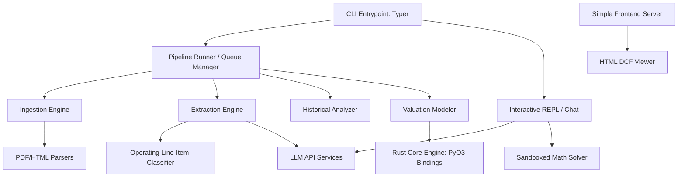
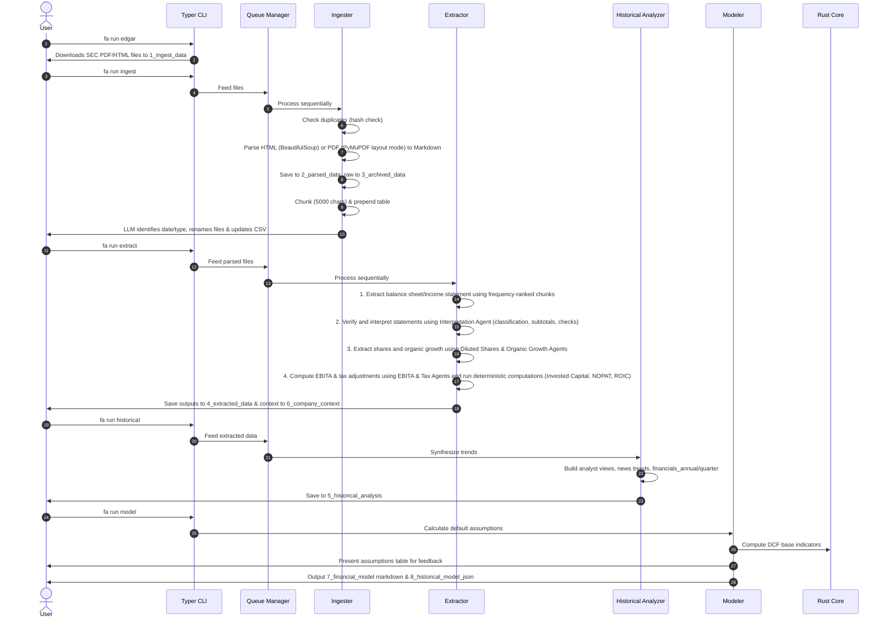
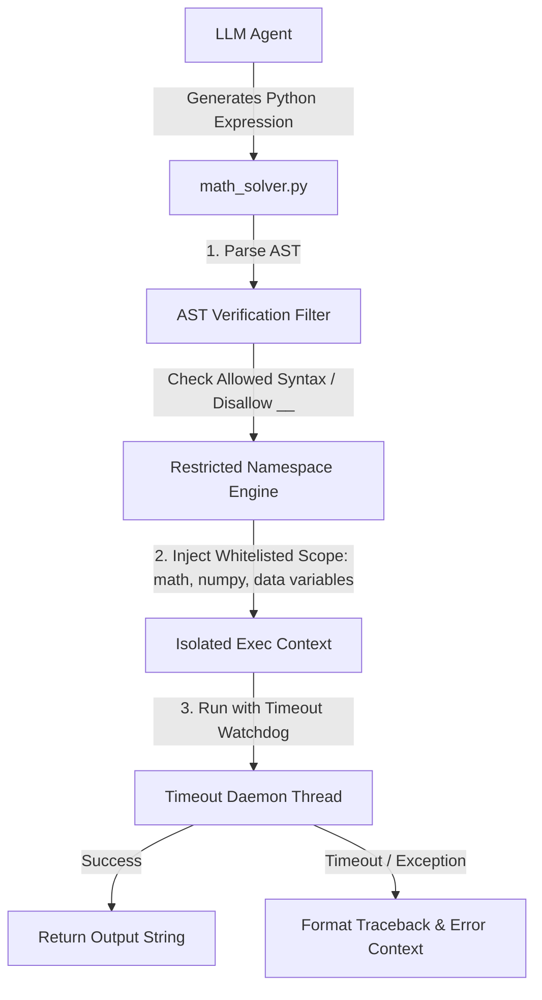

# System Architecture

This document describes the high-level architecture, directory layout, and data flow of the Financial Analyst CLI (`fa`).

---

## 1. High-Level Architecture

The system is designed as a modular Python CLI that delegates heavy financial computations to a high-performance Rust core engine. It utilizes LLM services for unstructured parsing, information extraction, and qualitative assessments.



---

## 2. Directory Structure

The repository is structured as a hybrid Python-Rust application using `maturin` to build PyO3-based Rust extensions.

```
financial-analyst-cli/
├── docs/                           # Project documentation
│   ├── architecture.md
│   ├── cli_spec.md
│   ├── requirements.md
│   └── roadmap.md
├── scripts/                        # Legacy reference scripts (DO NOT use as-is)
├── tmp/                            # Temporary logs, scratchpads, and scripts
├── src/                            # Application source code
│   ├── __init__.py
│   ├── cli/                        # Typer CLI commands definition
│   │   ├── __init__.py
│   │   ├── commands/               # Sub-commands (run, query, config, viewer, chat)
│   │   └── main.py
│   ├── core/                       # Shared models, settings, and constants
│   │   ├── __init__.py
│   │   ├── config.py               # Credentials & active workspace configurations
│   │   ├── exceptions.py           # Custom exception classes
│   │   └── models.py               # Pydantic schemas for verification
│   ├── services/                   # External API clients
│   │   ├── __init__.py
│   │   ├── edgar_client.py         # SEC EDGAR download API client
│   │   ├── llm_client.py           # Unified client for text & vision LLMs
│   │   ├── web_search.py           # Fallback search for accounting classifications
│   │   └── math_solver.py          # Sandboxed Python execution for custom calculations
│   ├── pipeline/                   # Sequential pipeline orchestration
│   │   ├── __init__.py
│   │   ├── queue.py                # Safe job queue & retry manager
│   │   ├── ingester.py             # File ingestion, hashing & chunking
│   │   ├── extractor_orchestrator.py # Routing extraction jobs to sub-extractors
│   │   ├── extractor_financials.py  # Specialized extractor for 10K, 10Q, 20F, etc.
│   │   ├── extractor_analyst_report.py # Specialized extractor for analyst reports
│   │   ├── extractor_transcript.py  # Specialized extractor for transcripts
│   │   ├── extractor_other.py       # Specialized extractor for other types
│   │   ├── analyzer.py             # Historical synthesis & trend tracking
│   │   └── modeler.py              # Assumption processing & model generation
│   ├── rust_core/                  # Rust performance critical calculation engine
│   │   └── lib.rs                  # PyO3 bindings for financial math (WACC, DCF, ROIC)
│   ├── viewer/                     # HTML viewer code
│   │   └── index.html              # Zero-dependency interactive web viewer
│   ├── resources/                  # Static assets and reference documentation
│   │   └── dictionary/             # Central accounting classification guidelines
│   │       ├── index.md            # Registry index of all tracked financial line items
│   │       ├── revenue.md          # Revenue definitions and treatment
│   │       ├── operating_income.md # Operating income treatment
│   │       └── ...                 # Other individual line item markdowns
│   └── utils/                      # Formatting and filesystem utilities
│       ├── __init__.py
│       ├── formatting.py           # Rich-based console output utilities
│       └── filesystem.py           # Custom CSV and markdown mutation helpers
├── Cargo.toml                      # Cargo manifest for Rust module
├── pyproject.toml                  # uv / maturin configuration
└── main.py                         # Root entry point delegating to src/cli/main.py
```

---

## 3. Data Pipeline Flow



---

## 4. Key Architectural Decisions

1. **Deterministic Job Queue**:
   To avoid race conditions and resource leaks during file processing and LLM calls, all pipeline commands (`ingest`, `extract`, `historical`) feed into a centralized queue runner. Jobs are completed sequentially with exponential back-off retries.
2. **Hybrid Python-Rust Framework**:
   All core arithmetic (discounting cash flows, compounding, WACC calculation, ROIC schedules) is written in Rust (`src/rust_core/lib.rs`) for performance, safety, and correctness, compiled as a Python C-extension. Python handles orchestration, file operations, LLM prompts, and CLI interactions.
   Pydantic schemas validate all payloads crossed between Python and Rust to maintain strict structural contracts.
3. **Chunked LLM Processing**:
   To avoid context bloat and high API costs, files are split into 5,000-character chunks. The LLM only receives `chunk_id=0` (the character inventory index) and pulls subsequent chunks one-by-one as needed.
4. **Self-Healing Company Context**:
    The `6_company_context/` directory contains company-specific guidelines (`ingest_context.md`, `extract_context.md`, `model_context.md`). While `ingest_context.md` and `model_context.md` may be updated/compiled during runs, `extract_context.md` is reserved strictly for manual user feedback to record custom classifications and avoid reinforcing agent errors. These files capture fiscal mappings, statement layout preferences, and custom account classifications to ensure future runs align with the specific company.
5. **Interactive Zero-Dependency HTML Viewer**:
   The viewer command (`fa viewer`) launches a local server hosting a self-contained HTML page. This app reads JSON data from `8_historical_model_json/`, runs DCF projections client-side, lets the user play with assumptions dynamically, and saves updated projections directly back to the workspace.
6. **Auditable Traceability**:
   All metrics in the data lake (down to individual cells) must contain strict metadata properties tracking their provenance (`source_file`, `chunk_id`, `exact_snippet`). This ensures all calculated valuations can be verified in a single query, preventing model hallucination.
7. **Interactive Shell with Sandboxed Execution**:
   To move beyond static pipelines, `fa chat` implements a stateful conversational loop. It exposes a math solver tool (`math_solver.py`) that executes mathematical Python code in a safe sandbox to perform ad-hoc quantitative operations over extracted data.
8. **Formatting-Preserving PDF/HTML Parsing**:
   To ensure that unstructured documents like financial reports, earnings announcements, and SEC filings are digested accurately without losing structural relationships, the ingestion engine employs custom parsing. HTML filings are converted to Markdown with column-preserving tables via BeautifulSoup. PDF reports are parsed using PyMuPDF (`pymupdf`) in physical layout-preservation mode (`page.get_text("layout")`), which retains spacing, table grid relationships, and columnar flows, avoiding garbled outputs.


---

## 5. Sandboxed Execution Architecture

To execute LLM-generated math calculations safely on the user's host OS (Windows) without the high overhead and dependency requirements of local Docker containers, the `math_solver.py` service implements an in-process AST (Abstract Syntax Tree) sandboxed executor based on `RestrictedPython`:



### Sandbox Containment Mechanisms:
1. **AST Node Filtering:** Blocks execution of forbidden syntax elements (e.g., imports, attribute mutations, private double-underscore `__` accessors).
2. **Namespace Isolation:** Execution scope is restricted to a custom dictionary containing only whitelisted functions (`math` libraries, safe `numpy` helpers, basic builtins like `abs`, `min`, `max`, `sum`) and read-only injections of the company's historical financial tables.
3. **Execution Guardrails:** Thread-wrapped timeout controls terminate execution if processing exceeds a strict 5-second CPU time limit, guarding against infinite loops or resource starvation attacks.
