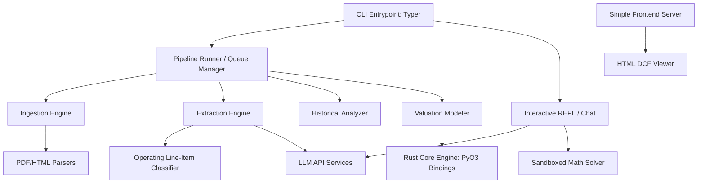
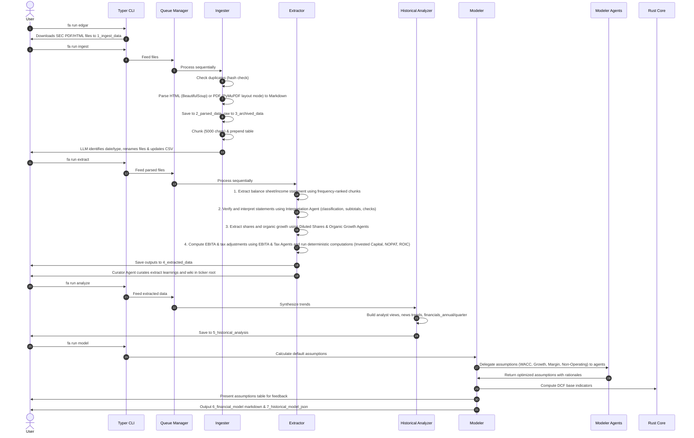
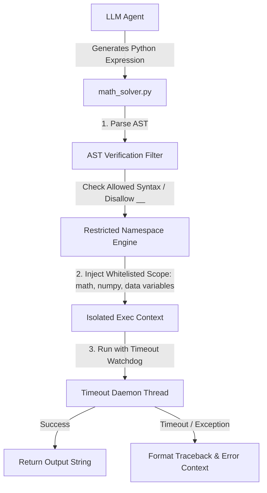

# System Architecture

This document describes the high-level architecture, directory layout, and data flow of the Financial Analyst CLI (`fa`).

---

## 1. High-Level Architecture

The system is designed as a modular Python CLI that executes standard data pipeline math directly in Python, while delegating intensive financial modeling and multi-scenario sensitivity analyses to a compiled Rust core engine. It utilizes LLM services for unstructured parsing, information extraction, and qualitative assessments.



---

## 2. Directory Structure

The repository is structured as a hybrid Python-Rust application using `maturin` to build PyO3-based Rust extensions.

```
financial-analyst-cli/
├── docs/                           # Project documentation
│   ├── architecture.md
│   ├── cli_spec.md
│   ├── requirements.md
│   └── roadmap.md
├── tmp/                            # Temporary logs, scratchpads, and scripts
├── src/                            # Application source code
│   ├── __init__.py
│   ├── cli/                        # Typer CLI commands definition
│   │   ├── __init__.py
│   │   ├── commands/               # Sub-commands (run, query, config, viewer, chat)
│   │   └── main.py
│   ├── core/                       # Shared models, settings, and constants
│   │   ├── __init__.py
│   │   ├── config.py               # Credentials & active workspace configurations
│   │   ├── exceptions.py           # Custom exception classes
│   │   └── models.py               # Pydantic schemas for verification
│   ├── services/                   # External API clients
│   │   ├── __init__.py
│   │   ├── edgar_client.py         # SEC EDGAR download API client
│   │   ├── llm_client.py           # Modular provider-specific clients (Gemini, DeepSeek, OpenRouter) and factory creation
│   │   ├── market_data.py          # Yahoo Finance market data and ticker checker
│   │   ├── web_search.py           # Fallback search for accounting classifications
│   │   └── math_solver.py          # Sandboxed Python execution for custom calculations
│   ├── pipeline/                   # Sequential pipeline orchestration
│   │   ├── __init__.py
│   │   ├── queue.py                # Safe job queue & retry manager
│   │   ├── ingester.py             # File ingestion, hashing & chunking
│   │   ├── document_types.json     # Mapping definitions for supported report types
│   │   ├── extractor_orchestrator.py # Routing extraction jobs to sub-extractors
│   │   ├── extractor_agents/        # Folder containing specialized extractors and agents
│   │   │   ├── extractor_financials.py # Specialized coordinator for 10K, 10Q, 20F, etc.
│   │   │   ├── extractor_analyst_report.py # Specialized extractor for analyst reports
│   │   │   ├── extractor_transcript.py # Specialized extractor for transcripts
│   │   │   ├── extractor_other.py   # Specialized extractor for other types
│   │   │   └── extractor_financials_agents/ # Nested financial sub-agents
│   │   │       ├── income_statement_agent.py # Income Statement extraction agent
│   │   │       ├── balance_sheet_agent.py # Balance Sheet extraction agent
│   │   │       ├── interpretation_agent.py # Financial statement interpretation agent
│   │   │       ├── diluted_shares_agent.py # Basic/diluted shares extraction agent
│   │   │       ├── organic_growth_agent.py # Organic revenue growth agent
│   │   │       ├── ebita_agent.py          # Operating EBITA adjustments agent
│   │   │       └── tax_agent.py            # Adjusted taxes agent
│   │   ├── analyzer.py             # Historical synthesis & trend tracking
│   │   ├── modeler.py              # Redirect wrapper module
│   │   ├── modeler_orchestrator.py # Orchestrates DCF financial modeling
│   │   └── modeler_agents/         # Directory containing specialized modeling agents
│   │       ├── wacc_agent.py       # WACC calculation and beta de-levering/re-levering
│   │       ├── growth_agent.py     # Estimating future revenue growth rates
│   │       ├── margin_agent.py     # Estimating future EBITA margins
│   │       ├── non_operating_agent.py # Extracting non-operating balance sheet categories
│   │       └── dcf_modeling_agent.py # Sanity-checking valuation parameters, currency, comments/critiques
│   ├── tools/                      # Reusable agent tools package
│   │   ├── __init__.py
│   │   ├── find_chunk.py           # Tool to extract chunk content by ID
│   │   ├── keyword_search.py       # Tool to find occurrences of keywords
│   │   ├── web_search.py           # Tool to search Investopedia
│   │   └── pull_markdown.py        # Tool to safe lookup of markdown files
│   ├── rust_core/                  # Rust performance critical calculation engine
│   │   └── lib.rs                  # PyO3 bindings for financial math (WACC, DCF, ROIC)
│   ├── viewer/                     # HTML viewer code
│   │   └── index.html              # Zero-dependency interactive web viewer
│   ├── resources/                  # Static assets and reference documentation
│   │   └── dictionary/             # Central accounting classification guidelines
│   │       ├── index.md            # Registry index of all tracked financial line items
│   │       ├── revenue.md          # Revenue definitions and treatment
│   │       ├── operating_income.md # Operating income treatment
│   │       └── ...                 # Other individual line item markdowns
│   └── utils/                      # Formatting and filesystem utilities
│       ├── __init__.py
│       ├── formatting.py           # Rich-based console output utilities
│       ├── math.py                 # Pure Python financial calculations
│       ├── pig_animation.py        # Sir Pennyworth pig console animation
│       └── tools.py                # Universal utility tools (context finding, appenders)
├── Cargo.toml                      # Cargo manifest for Rust module
├── pyproject.toml                  # uv / maturin configuration
└── main.py                         # Root entry point delegating to src/cli/main.py
```

---

## 3. Data Pipeline Flow



---

## 4. Key Architectural Decisions

1. **Deterministic Job Queue**:
   To avoid race conditions and resource leaks during file processing and LLM calls, all pipeline commands (`ingest`, `extract`, `analyze`) feed into a centralized queue runner. Jobs are completed sequentially with exponential back-off retries.
2. **Hybrid Python-Rust Framework**:
   Core financial valuation and sensitivity modeling (discounting cash flows, compounding, WACC calculations) are written in Rust (`src/rust_core/lib.rs`) for performance, safety, and correctness, compiled as a Python C-extension. Standard pipeline calculations (EBITA, Invested Capital, Tax Rates, and ROIC schedules) are written in pure Python to simplify development, testing, and out-of-the-box execution.
3. **Chunked LLM Processing**:
   To avoid context bloat and high API costs, files are split into 5,000-character chunks. The LLM only receives `chunk_id=0` (the character inventory index) and pulls subsequent chunks one-by-one as needed.
4. **Self-Refining LLMWiki & Learning Files**:
    Instead of an isolated context directory, company-specific context is maintained directly in each ticker's root workspace directory via 4 markdown files: `[TICKER]_wiki.md`, `[TICKER]_extract_learning.md`, `[TICKER]_analyze_learning.md`, and `[TICKER]_model_learning.md`. A dedicated `LLMWiki_curator_agent` runs after each pipeline stage, absorbing any manual user feedback and new run logs to continuously rewrite, refine, and compact the learnings, preventing memory loss and reinforcing correct behavior.
5. **Interactive Zero-Dependency HTML Viewer**:
   The viewer command (`fa viewer`) launches a local server hosting a self-contained HTML page. This app reads JSON data from `7_historical_model_json/`, runs DCF projections client-side, lets the user play with assumptions dynamically, and saves updated projections directly back to the workspace.
6. **Auditable Traceability**:
   All metrics in the data lake (down to individual cells) must contain strict metadata properties tracking their provenance (`source_file`, `chunk_id`, `exact_snippet`). This ensures all calculated valuations can be verified in a single query, preventing model hallucination.
7. **Interactive Shell with Sandboxed Execution**:
   To move beyond static pipelines, `fa chat` implements a stateful conversational loop. It exposes a math solver tool (`math_solver.py`) that executes mathematical Python code in a safe sandbox to perform ad-hoc quantitative operations over extracted data.
8. **Formatting-Preserving PDF/HTML Parsing**:
   To ensure that unstructured documents like financial reports, earnings announcements, and SEC filings are digested accurately without losing structural relationships, the ingestion engine employs custom parsing. HTML filings are converted to Markdown with column-preserving tables via BeautifulSoup. PDF reports are parsed using PyMuPDF (`pymupdf`) in physical layout-preservation mode (`page.get_text("layout")`), which retains spacing, table grid relationships, and columnar flows, avoiding garbled outputs.


---

## 5. Sandboxed Execution Architecture

To execute LLM-generated math calculations safely on the user's host OS (Windows) without the high overhead and dependency requirements of local Docker containers, the `math_solver.py` service implements an in-process AST (Abstract Syntax Tree) sandboxed executor based on `RestrictedPython`:



### Sandbox Containment Mechanisms:
1. **AST Node Filtering:** Blocks execution of forbidden syntax elements (e.g., imports, attribute mutations, private double-underscore `__` accessors).
2. **Namespace Isolation:** Execution scope is restricted to a custom dictionary containing only whitelisted functions (`math` libraries, safe `numpy` helpers, basic builtins like `abs`, `min`, `max`, `sum`) and read-only injections of the company's historical financial tables.
3. **Execution Guardrails:** Thread-wrapped timeout controls terminate execution if processing exceeds a strict 5-second CPU time limit, guarding against infinite loops or resource starvation attacks.

---

## 6. Self-Learning LLMWiki & Curator Agent Architecture

The self-learning mechanism replaces separate config folders with 4 dedicated root files per company workspace:

### Workspace LLMWiki & Index Files
- `[TICKER]_wiki.md`: Stores qualitative perspectives (Bull & Bear) extracted strictly from recent document context without outside knowledge pollution.
- `[TICKER]_folder_index.md`: Automatically maintained folder index mapping all files in 4_extracted_data, 5_historical_analysis, and 6_financial_model with their metadata (relative paths, size, modified date, type, summary/description) to help other agents search and find data.
- `[TICKER]_extract_learning.md`: Stores the fiscal schedule end-dates (Q1, Q2, Q3, FY) and extraction lessons (e.g., handling ambiguous table rows or subtotal overlaps) across financials, analyst reports, transcripts, and other document types.
- `[TICKER]_analyze_learning.md`: Stores qualitative/trend analysis lessons.
- `[TICKER]_model_learning.md`: Stores modeling lessons (e.g., ADR conversion ratios, base currencies, WACC inputs).

### Curator Agent Logic (`CuratorAgent`)
The `CuratorAgent` class (in `src/pipeline/curator_agent.py`) executes compaction after each pipeline stage completes:
1. **User Feedback Extraction**: It scans the file for a `## User Feedback` header, extracts everything underneath it, and filters out placeholder HTML comments.
2. **LLM Compaction**: It feeds the existing markdown body, new user feedback, and recent stage logs (or compiled historical analysis outputs in the case of the analyze stage) to the LLM, instructing it to keep the learnings highly succinct and focused strictly on actionable information that will help future AI agent tasks (such as search keywords or line item mappings), while discarding conversational filler and generic advice.
3. **Rewrite & Clean**: The LLM compiles the feedback into the lessons sections, rewrites the file to be highly succinct, and resets the `## User Feedback` section back to its blank template state.
