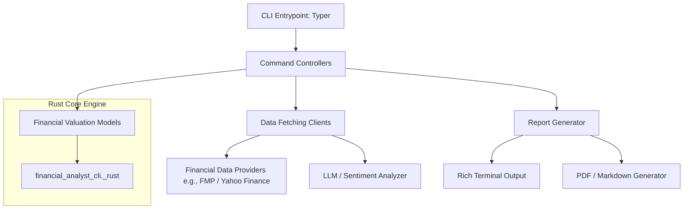

# System Architecture

This document describes the architectural layout, modules, and data flow of the Financial Analyst CLI application.

## High-Level Architecture



## Directory Structure

We organize the codebase as a hybrid Python/Rust application using [Maturin](https://github.com/PyO3/maturin) to build PyO3-based Rust extensions:

```
financial-analyst-cli/
├── docs/                      # Project documentation
│   ├── architecture.md
│   ├── cli_spec.md
│   └── requirements.md
├── src/                       # Application source code
│   ├── __init__.py
│   ├── cli/                   # Typer CLI definition & entry points
│   │   ├── __init__.py
│   │   ├── commands/          # Sub-commands implementation
│   │   └── main.py
│   ├── core/                  # Core modules & models
│   │   ├── __init__.py
│   │   ├── config.py          # Configuration & settings management
│   │   ├── exceptions.py      # Custom exception classes
│   │   └── models.py          # Pydantic models for data structures
│   ├── services/              # External services & data clients
│   │   ├── __init__.py
│   │   ├── financial_data.py  # Wrapper for financial API providers
│   │   └── llm_service.py     # Sentiment analysis & report summarization
│   ├── models/                # Mathematical/financial valuation engines
│   │   ├── __init__.py
│   │   ├── dcf.py             # DCF valuation wrapper calling Rust Core
│   │   └── comps.py           # Comparable analysis engine calling Rust Core
│   ├── rust_core/             # Rust high-performance calculations
│   │   └── lib.rs             # PyO3 module and calculation logic
│   └── utils/                 # General helpers (formatting, exports)
│       ├── __init__.py
│       ├── formatting.py      # Rich terminal format helpers
│       └── reporter.py        # PDF/Markdown exporting utilities
├── Cargo.toml                 # Cargo manifest for Rust module
├── pyproject.toml             # uv / maturin configuration
└── main.py                    # Root entry point delegating to src/cli/main.py
```

## Key Architectural Decisions

1. **Hybrid Python-Rust Design**: High-performance mathematical projections and safety-critical valuation logic (DCF calculations, discount factoring, terminal growth valuation, comps analysis) are written in Rust. Python coordinates high-level tasks like CLI execution, LLM prompts, API calls, and report formatting.
2. **PyO3 Extension Module**: The Rust crate is compiled into a native Python extension module (`financial_analyst_cli._rust`) using Maturin, providing seamless import capabilities and type conversions.
3. **Modular Services**: Separate data retrieval from business/financial logic. Data providers can be easily swapped or mocked during testing.
4. **Pydantic Data Models**: All API payloads and internal data structures will be parsed and validated using Pydantic to ensure type safety before passing to the Rust calculation layer.
5. **Local Configuration**: Configuration settings (like API keys and selected model IDs) will be saved in a `.env` file at the project root directory. The application will load these settings using `python-dotenv` / Pydantic, with support for standard system environment variables as a fallback.
6. **LLM Provider Flexibility**: By default, the application integrates with OpenRouter, defaulting to the Gemma model (`google/gemma-4-31b-it:free` if available, falling back to `google/gemma-4-31b-it`). The LLM client wrapper in `llm_service.py` is provider-agnostic, supporting standard OpenAI-compatible API schemas. Users can configure any alternative endpoint (OpenAI, Anthropic, Gemini, local Ollama) and custom model ID in their local settings.
