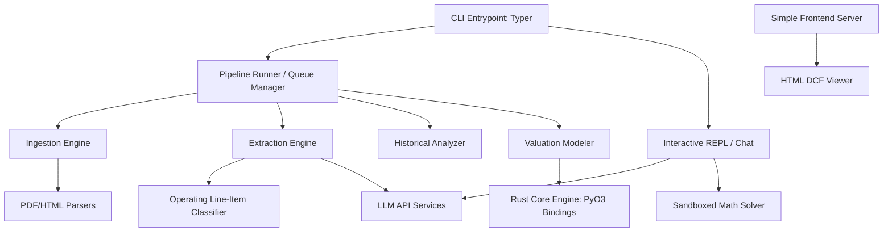
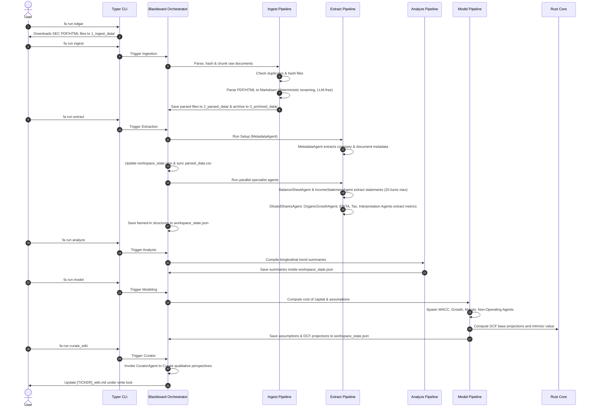
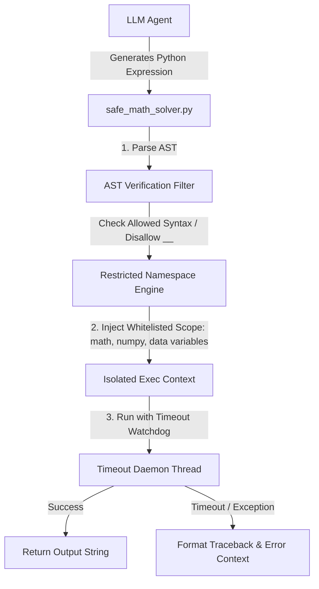

# System Architecture

This document describes the high-level architecture, directory layout, and data flow of the Financial Analyst CLI (`fa`).

---

## 1. High-Level Architecture

The system is designed as a modular Python CLI that executes standard data pipeline math directly in Python, while delegating intensive financial modeling and multi-scenario sensitivity analyses to a compiled Rust core engine. It utilizes LLM services for unstructured parsing, information extraction, and qualitative assessments.



---

### 2. Directory Structure

The repository is structured as a hybrid Python-Rust application using `maturin` to build PyO3-based Rust extensions.

```
financial-analyst-cli/
├── docs/                           # Project documentation
│   ├── architecture.md
│   ├── blackboard_design.md        # Specs for blackboard state schema
│   ├── cli_spec.md
│   ├── requirements.md
│   └── roadmap.md
├── tmp/                            # Temporary logs, scratchpads, and scripts
├── src/                            # Application source code
│   ├── __init__.py
│   ├── cli/                        # Typer CLI commands definition
│   │   ├── __init__.py
│   │   ├── commands/               # Sub-commands (run, query, config, viewer, chat)
│   │   └── main.py
│   ├── core/                       # Shared configuration, exceptions & blackboard schemas
│   │   ├── __init__.py
│   │   ├── config.py               # Credentials & active workspace configurations
│   │   ├── exceptions.py           # Custom exception classes
│   │   └── blackboard.py           # Blackboard domain schemas & atomic load/save state managers
│   ├── services/                   # External API clients & sandbox tools
│   │   ├── __init__.py
│   │   ├── edgar_client.py         # SEC EDGAR download API client
│   │   ├── llm_client.py           # Unified model client & client factory get_llm_client
│   │   ├── gemini_client.py        # Gemini client implementation wrapping google-genai SDK
│   │   ├── deepseek_client.py      # DeepSeek client implementation with thinking token options
│   │   ├── openrouter_client.py    # OpenRouter client implementation with standardized headers
│   │   ├── market_data.py          # Yahoo Finance market data and ticker checker
│   │   ├── ddg_search.py           # DuckDuckGo search service
│   │   ├── safe_math_solver.py     # AST-sandboxed mathematical equation solver
│   │   └── queue.py                # Safe job queue & retry manager
│   ├── agents/                     # Execution runner stages (ingest, extract, analyze, model)
│   │   ├── __init__.py
│   │   ├── agent_executor.py       # Unified agent turn-based execution loop coordinator
│   │   ├── blackboard_orchestrator.py # Coordinates pipeline stage execution & status transitions
│   │   ├── orchestrator_pipelines/  # Modular pipeline execution stage files (ingest, extract, analyze, model)
│   │   ├── curator_agent.py        # Curator agent for summarizing learnings and refining qualitative views
│   │   ├── learning_agent.py       # Learning agent for capturing run learnings & blackboard updates
│   │   ├── extractor_agents/        # Folder containing specialized extractors and agents
│   │   │   ├── extractor_analyst_report.py # Specialized extractor for analyst reports
│   │   │   ├── extractor_other.py   # Specialized extractor for other types
│   │   │   ├── metadata_agent.py    # Extracts company-wide and document-level metadata
│   │   │   └── extractor_financials_agents/ # Nested financial sub-agents
│   │   │       ├── income_statement_agent.py # Income Statement extraction agent
│   │   │       ├── balance_sheet_agent.py # Balance Sheet extraction agent
│   │   │       ├── interpretation_agent.py # Financial statement interpretation agent
│   │   │       ├── diluted_shares_agent.py # Basic/diluted shares extraction agent
│   │   │       ├── organic_growth_agent.py # Organic revenue growth agent
│   │   │       ├── ebita_agent.py          # Operating EBITA adjustments agent
│   │   │       └── tax_agent.py            # Adjusted taxes agent
│   │   └── modeler_agents/         # Directory containing specialized modeling agents
│   │       ├── wacc_agent.py       # WACC calculation and beta de-levering/re-levering
│   │       ├── growth_agent.py     # Estimating future revenue growth rates
│   │       ├── margin_agent.py     # Estimating future EBITA margins
│   │       ├── non_operating_agent.py # Extracting non-operating balance sheet categories
│   │       └── dcf_modeling_agent.py # Sanity-checking valuation parameters, currency, comments/critiques
│   ├── tools/                      # Reusable agent tools package
│   │   ├── __init__.py
│   │   ├── find_chunk.py           # Tool to extract chunk content by ID
│   │   ├── keyword_search.py       # Tool to find occurrences of keywords
│   │   ├── investopedia_search.py  # Investopedia search tool
│   │   ├── access_resources.py     # Tool to safely look up static markdown dictionary templates
│   │   └── query_blackboard.py     # Core helper to query the in-memory blackboard state
│   ├── rust_core/                  # Rust performance critical calculation engine
│   │   └── lib.rs                  # PyO3 bindings for financial math (WACC, DCF, ROIC)
│   ├── viewer/                     # HTML viewer code
│   │   └── index.html              # Zero-dependency interactive web viewer
│   ├── resources/                  # Static assets and reference documentation
│   │   ├── document_types.json     # Mapping definitions for supported report types
│   │   └── dictionary/             # Central accounting classification guidelines
│   │       ├── income_statement.md # Income statement definitions
│   │       └── balance_sheet.md    # Balance sheet definitions
│   └── utils/                      # Formatting and filesystem utilities
│       ├── __init__.py
│       ├── formatting.py           # Rich-based console output utilities
│       ├── financial_math.py       # Pure Python financial calculations
│       ├── pig_animation.py        # Sir Pennyworth pig console animation
│       └── markdown_helper.py      # Markdown append/edit, table validation, and JSON parsing helpers
├── Cargo.toml                      # Cargo manifest for Rust module
├── pyproject.toml                  # uv / maturin configuration
└── main.py                         # Root entry point delegating to src/cli/main.py
```

---

## 3. Data Pipeline Flow



---

## 4. Key Architectural Decisions

1. **Deterministic Job Queue**:
   To avoid race conditions and resource leaks during file processing and LLM calls, all pipeline commands (`ingest`, `extract`, `analyze`, `model`) feed into a centralized queue runner. Jobs are completed sequentially with exponential back-off retries.
2. **Hybrid Python-Rust Framework**:
   Core financial valuation and sensitivity modeling (discounting cash flows, compounding, WACC calculations) are written in Rust (`src/rust_core/lib.rs`) for performance, safety, and correctness, compiled as a Python C-extension. Standard pipeline calculations (EBITA, Invested Capital, Tax Rates, and ROIC schedules) are written in pure Python to simplify development, testing, and out-of-the-box execution.
3. **Chunked LLM Processing**:
   To avoid context bloat and high API costs, files are split into 5,000-character chunks. The LLM only receives `chunk_id=0` (the character inventory index) and pulls subsequent chunks one-by-one as needed.
4. **Self-Learning Blackboard & Markdown Wiki**:
    Rather than maintaining multiple local learning markdown files, company-specific context is maintained in a single structured Pydantic Blackboard (`workspace_state.json`). Successful queries, turn metrics, and custom mappings are written back to `company_data.learnings` by the `LearningAgent`. A dedicated `CuratorAgent` compiles qualitative perspectives (Bull & Bear views) into `[TICKER]_wiki.md`.
5. **Interactive Zero-Dependency HTML Viewer**:
    The viewer command (`fa viewer`) launches a local server hosting a self-contained HTML page. This app reads JSON data from `workspace_state.json`, runs DCF projections client-side, lets the user play with assumptions dynamically, and saves updated scenario models directly to `9_scenario_model_json/`.
6. **State Lifecycle and Persistence**:
    Updates to the blackboard are managed under a **Single-Writer Pattern** where only the orchestrator mutates status flags and commits state checkpoints to the disk atomically via `os.replace` to prevent data corruption.
7. **Interactive Shell with Sandboxed Execution**:
   To move beyond static pipelines, `fa chat` implements a stateful conversational loop. It exposes a math solver tool (`math_solver.py`) that executes mathematical Python code in a safe sandbox to perform ad-hoc quantitative operations over extracted data.
8. **Formatting-Preserving PDF/HTML Ingestion**:
   To ensure that unstructured documents like financial reports, earnings announcements, and SEC filings are digested accurately without losing structural relationships, the ingestion engine employs custom parsing. HTML filings are converted to Markdown with column-preserving tables via BeautifulSoup. PDF reports are parsed using PyMuPDF (`pymupdf`) in physical layout-preservation mode (`page.get_text("layout")`), which retains spacing, table grid relationships, and columnar flows, avoiding garbled outputs.

---

## 5. Sandboxed Execution Architecture

To execute LLM-generated math calculations safely on the user's host OS (Windows) without the high overhead and dependency requirements of local Docker containers, the `safe_math_solver.py` service implements an in-process AST (Abstract Syntax Tree) sandboxed executor based on `RestrictedPython`:



### Sandbox Containment Mechanisms:
1. **AST Node Filtering:** Blocks execution of forbidden syntax elements (e.g., imports, attribute mutations, private double-underscore `__` accessors).
2. **Namespace Isolation:** Execution scope is restricted to a custom dictionary containing only whitelisted functions (`math` libraries, safe `numpy` helpers, basic builtins like `abs`, `min`, `max`, `sum`) and read-only injections of the company's historical financial tables.
3. **Execution Guardrails:** Thread-wrapped timeout controls terminate execution if processing exceeds a strict 5-second CPU time limit, guarding against infinite loops or resource starvation attacks.

---

## 6. Self-Learning Blackboard & Curator Agent Architecture

The self-learning mechanism consolidates run-to-run feedback and pipeline indicators directly on the blackboard:

### Workspace State & Wiki Files
- `[TICKER]_wiki.md`: Stores qualitative perspectives (Bull & Bear) curated strictly from fanned-in document context without outside knowledge pollution.
- `workspace_state.json`: The central shared blackboard state storing extracted financial schedules, company metadata, longitudinal summaries, DCF calculations, and run-to-run agent learnings.

### Curator Agent Logic (`CuratorAgent`)
The `CuratorAgent` class (in `src/agents/curator_agent.py`) executes compilation after pipeline stages complete:
1. **User Feedback Extraction**: It scans `[TICKER]_wiki.md` for a `## User Feedback` header, extracts everything underneath it, and filters out placeholder HTML comments.
2. **LLM Synthesis**: It feeds the existing markdown body, new user feedback, and recent stage logs or summaries to the LLM, instructing it to refine and write comprehensive Bull and Bear perspectives.
3. **Rewrite & Clean**: The LLM compiles the feedback, rewrites the file, and resets the `## User Feedback` section back to its blank template state.

---

## 7. Reusable Agent Loop & Native Function Calling (Agentic Refactor)

The extraction and modeling sub-agents execute inside a unified turn-based loop coordinated by `src/agents/agent_executor.py`. This design replaces ad-hoc turn tracking and custom text-based JSON tool parser wrappers with Google's native Gemini API capabilities (Native Function Calling/Tool Use and Native Chat Sessions) while preserving compatibility for simulated tool execution with non-native APIs.

### Architecture Components:

1. **Centralized Agent Executor (`run_agent_loop` in `agent_executor.py`)**:
   - Manages the structured execution turn loop across all sub-agents.
   - Restricts agents to a configurable `max_turns` limit and injects safety warnings/finalization prompts (e.g. `CRITICAL: This is your final turn...`).
   - Standardizes tool results injection back to the chat history, verifying schemas and catching tool execution failures cleanly.

2. **Native Tool Calling (`GeminiChatSession` in `llm_client.py`)**:
   - Directly configures Google's Gemini client with standard Python functions as tools.
   - Automatically handles function dispatching when Gemini requests a tool call.
   - Feeds observations back to Gemini via `types.Part.from_function_response`.

3. **Fallback Simulation (`SimulatedChatSession` in `llm_client.py`)**:
   - Guarantees backward compatibility for OpenAI-compatible models (DeepSeek, OpenRouter).
   - Automatically generates tool text definitions using python introspection (inspecting tool docstrings and standard type hints) and appends them to the system prompt instructions.
   - Instructs the LLM to output a standard JSON action block, parses the action with `extract_json_from_text`, and maps it back to tool namespace executions, providing a transparent interface to `run_agent_loop`.

---

## 8. Micro-Agent & Blackboard Architecture

The system coordinates parallel and sequential task execution centered around the structured Blackboard state (`workspace_state.json`), executing template-based specialist agents dynamically.

### Orchestration Flow
```mermaid
graph TD
    %% Trigger & Activation
    UserTrigger([User Activation / CLI Trigger]) --> Orchestrator[Blackboard Orchestrator]
    TimeTrigger([Cron / Time Trigger]) --> Orchestrator

    %% The Blackboard State
    subgraph Blackboard (Shared Workspace Context)
        WorkspaceDB[(Workspace JSON Database: workspace_state.json)]
        StatusFlags[Task Completion & Validation State]
        ExtractedValues[Extracted Financials & Metrics]
        Learnings[Run Learnings & Lessons]
    end

    %% Orchestrator Loop
    Orchestrator <-->|1. Read Status / 3. Update Flags| StatusFlags

    %% Parallel Sub-Agent Templates
    subgraph Specialist Sub-Agent Templates
        IS[Income Statement Agent]
        BS[Balance Sheet Agent]
        OG[Organic Growth Agent]
        Tax[Tax Agent]
        Wacc[WACC Modeler Agent]
    end

    %% Blackboard Handoffs
    Orchestrator -->|Spawn Sub-Agent Template| IS
    Orchestrator -->|Spawn Sub-Agent Template| BS
    Orchestrator -->|Spawn Sub-Agent Template| OG
    Orchestrator -->|Spawn Sub-Agent Template| Tax
    Orchestrator -->|Spawn Sub-Agent Template| Wacc

    IS -->|Write Raw Items| ExtractedValues
    BS -->|Write Raw Items| ExtractedValues
    OG -->|Write Rates| ExtractedValues
    Tax -->|Write Tax Details| ExtractedValues
    Wacc -->|Write Cost of Capital| ExtractedValues

    %% Curation & Learning Sub-Agents
    Orchestrator -->|Spawn Curation Sub-Agent| CuratorAgent[Curator Agent]
    Orchestrator -->|Spawn Learning Sub-Agent| LearningAgent[Learning Agent]

    CuratorAgent -->|4. Update Robust Qualitative Views| TickerWiki[[[TICKER]_wiki.md]]
    LearningAgent -->|5. Maintain Lessons & Logs| Learnings
```

### Components

#### 1. The Blackboard Schema (`WorkspaceContext`)
The Blackboard acts as a structured domain model for a single target company workspace (saved as `workspace_state.json` at the root of the company's workspace folder). It stores all fanned-in extracted financials, longitudinal trends, DCF assumptions, and consolidated historical run learnings / audit logs.

#### 2. Blackboard Orchestrator (`src/agents/blackboard_orchestrator.py` & `src/agents/orchestrator_pipelines/`)
- Audits the blackboard as a whole and coordinates sub-agent scheduling.
- Mutates status flags and commits state checkpoints to the disk atomically via `os.replace` to prevent data corruption.
- Evaluates which components are `pending` or `failed` for the targeted stage, spawning specialist sub-agent templates dynamically.
- Manages execution gating, failure queuing, and recovery modes.

#### 3. Specialist Sub-Agent Templates (`src/agents/extractor_agents/` & `src/agents/modeler_agents/`)
- Standardized, reusable agent templates that are spawned on-demand by the Orchestrator.
- Purely functional and stateless—they consume isolated input contexts and return structured Pydantic schemas without direct disk write operations.
- Decoupled and pipeline-agnostic, validating prerequisite dependencies by querying the blackboard in a read-only manner using the `query_blackboard` tool.

#### 4. Curation & Learning Sub-Agents
- **`CuratorAgent`**: Responsible for digesting fanned-in data and user feedback to write qualitative views (Bull & Bear perspectives) in `[TICKER]_wiki.md` under write lock.
- **`LearningAgent`**: Evaluates turn deviation against execution benchmarks to run discretionary updates, writing successful keywords, target chunks, and execution histories back to `company_data.learnings`.

### Specialist Sub-Agent Templates & Tool Permissions Registry

To support decoupled execution, the system enforces a strict tool permission registry. Sub-agents are only granted access to the minimal set of tools needed for their operational boundaries.

| Specialist Sub-Agent Template | Category   | Permitted Tools / Services             | Mandatory Input Context                                                                | Rationale                                                                                                                |
| :---------------------------- | :--------- | :------------------------------------- | :------------------------------------------------------------------------------------- | :----------------------------------------------------------------------------------------------------------------------- |
| **`Ingester`**                | Ingestion  | None                                   | Active Ticker                                                                          | Parses, hashes, and chunks raw documents (deterministic, LLM-free renaming).                                             |
| **`MetadataAgent`**           | Setup      | `get_first_chunk`, `keyword_search`    | list of parsed document filenames                                                      | Runs once across all parsed documents to extract company-wide metadata and document-level metadata (dates, period, etc.). |
| **`BalanceSheetAgent`**       | Extraction | `find_chunk`, `keyword_search`, `check_balance_sheet_quality`         | target document filename, company metadata, agent learnings                            | Scans raw filings to extract assets, liabilities, and equity tables to return to the Orchestrator.                       |
| **`IncomeStatementAgent`**    | Extraction | `find_chunk`, `keyword_search`, `check_income_statement_quality`         | target document filename, company metadata, agent learnings                            | Scans raw filings to extract revenue, expenses, and income tables to return to the Orchestrator.                         |
| **`AnalystReportAgent`**      | Extraction | `find_chunk`, `keyword_search`         | target document filename, company metadata, agent learnings                            | Scans broker reports to extract moats, margins, and growth views.                                                        |
| **`OtherDocAgent`**           | Extraction | `find_chunk`, `keyword_search`         | target document filename, company metadata, agent learnings                            | Scans transcripts, press releases, and other general filings to generate qualitative summaries.                          |
| **`DilutedSharesAgent`**      | Metrics    | `keyword_search`, `query_blackboard`   | company metadata, income_statement, 10-Q/10-K filename, earnings announcement filename | Searches share counts tables, footnotes, and conversions in filings; extracts basic and diluted shares.                  |
| **`OrganicGrowthAgent`**      | Metrics    | `keyword_search`, `query_blackboard`   | company metadata, income_statement, 10-Q/10-K filename, earnings announcement filename | Searches constant currency and M&A impact disclosures; extracts organic revenue growth.                                  |
| **`InterpretationAgent`**     | Metrics    | `access_resources`, `query_blackboard` | company metadata, income_statement, balance_sheet                                      | Resolves ambiguous/generic lines against dictionaries; performs cross-statement validation checks.                       |
| **`OperatingEbitaAgent`**     | Metrics    | `keyword_search`, `query_blackboard`   | company metadata, income_statement, 10-Q/10-K filename, earnings announcement filename | Extracts operating income and audits non-recurring adjustments to calculate clean Operating EBITA.                       |
| **`AdjustedTaxesAgent`**      | Metrics    | `keyword_search`, `query_blackboard`   | company metadata, income_statement, 10-Q/10-K filename, earnings announcement filename | Scans tax rate reconciliation tables and footnotes; calculates adjusted taxes and tax rate.                              |
| **`WaccAgent`**               | Modeling   | `market_data`, `query_blackboard`      | company metadata, latest temporal period slice                                         | Fetches stock details and computes WACC parameters; queries latest reports for debt/cash details.                        |
| **`GrowthAgent`**             | Modeling   | `web_search`, `query_blackboard`       | latest temporal period slice, company metadata, trend tables                           | Formulates growth projections; retrieves historical revenues and margins.                                                |
| **`MarginAgent`**             | Modeling   | `web_search`, `query_blackboard`       | latest temporal period slice, company metadata, trend tables                           | Formulates margin targets; retrieves historical margins and analyst views.                                               |
| **`NonOperatingAgent`**       | Modeling   | `access_resources`, `query_blackboard` | latest temporal period slice                                                           | Queries/extracts the 6 non-operating categories from the latest fanned-in balance sheet state.                           |
| **`DcfModelingAgent`**        | Modeling   | `query_blackboard`                     | company metadata, latest temporal period slice, model assumptions                      | Sanity-checks and critiques the completed valuation parameters and assumptions.                                          |
| **`CuratorAgent`**            | Curation   | `query_blackboard`                     | company metadata, complete WorkspaceContext                                            | Solely responsible for writing and updating the `[TICKER]_wiki.md` file.                                                 |
| **`LearningAgent`**           | Learning   | `query_blackboard`                     | target sub-agent name, document type, turn counts/run logs                             | Responsible for writing and maintaining the run learnings and feedback logs into the blackboard.                         |
