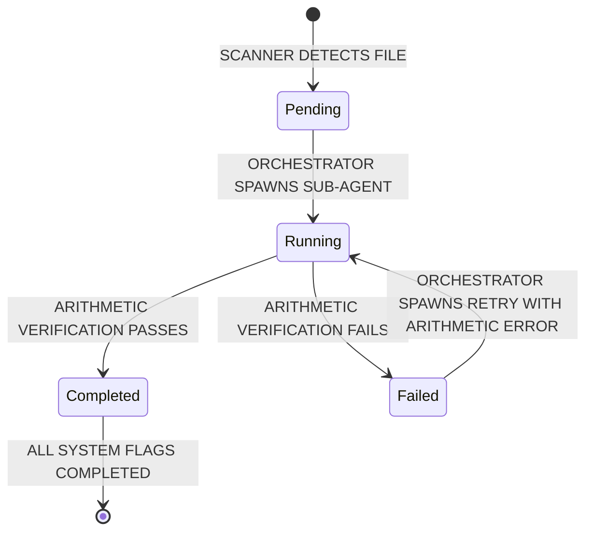

# Blackboard Design Specification

This document defines the structural schema, storage mechanics, state transition guidelines, and verification formulas for the **Blackboard Pattern** state manager in the `financial-analyst-cli` workspace.

---

## 1. Architectural Decision: Single vs. Multiple Blackboards

### The Industry Standard: Context Isolation

In production multi-agent systems, the standard approach is to use **one blackboard per operational boundary (i.e., one per company/ticker)**.

We will implement a **Single Blackboard Per Ticker** pattern (saved as `workspaces/[TICKER]/workspace_state.json`).

#### Why a Unified Shared Blackboard is a Bad Idea:

1. **Context Contamination**: Exposing multiple companies' financials to extraction/modeling agents in a single shared state dramatically increases LLM hallucination rates and prompt token bloat.
2. **File Contention & Locking**: Running autonomous pipelines for multiple companies in parallel would create constant write-lock conflicts if all agents targeted a single global file.
3. **Modular Backup & Portability**: Storing state locally per company allows developers to easily copy, audit, or delete specific company workspaces without corrupting other files.

#### How Cross-Company Queries are Handled (The Read-Only Aggregator):

To support multi-company queries in the future **Interactive Chat Mode** (e.g., _"Which company has the highest organic growth rate?"_), we do not query live, fanned-out JSON blackboards. Instead:

- Individual blackboards remain write-only by their respective pipeline runs.
- At the end of each company run, a lightweight indexer agent crawls the `workspace_state.json` file and synchronizes the flat key metrics into a **global read-only JSON index** (`workspaces/workspace_index.json`) at the project root.
- The Chat Agent queries this local consolidated JSON index for instant cross-company comparisons.

---

## 2. Complete Pydantic Domain Schema

The Blackboard acts as a structured model matching the exact mathematical steps in [financial_math.py](file:///f:/AIML%20projects/financial-analyst-cli/src/utils/financial_math.py) and [modeler_orchestrator.py](file:///f:/AIML%20projects/financial-analyst-cli/src/agents/modeler_orchestrator.py).

```python
from pydantic import BaseModel, Field
from typing import List, Dict, Optional, Literal

# =====================================================================
# 1. CORE SUPPORTING MODELS
# =====================================================================

class LineItem(BaseModel):
    line_name: str
    value: float
    operating: bool = True
    calculated: bool = False
    category: Literal[
        "current_assets",
        "noncurrent_assets",
        "current_liabilities",
        "noncurrent_liabilities",
        "equity",
        "income_statement"
    ]


# =====================================================================
# 2. COMPANY METADATA (Ingestion & Setup Properties)
# =====================================================================

class CompanyMetadata(BaseModel):
    """Company-wide constant configurations identified during ingest."""
    ticker: str
    company_name: Optional[str] = None
    description: Optional[str] = None  # Short description of the company business model

    # Fiscal calendar boundary dates
    fiscal_q1_date: Optional[str] = None
    fiscal_q2_date: Optional[str] = None
    fiscal_q3_date: Optional[str] = None
    fiscal_q4_date: Optional[str] = None  # Fiscal year-end date

    # Currency and Unit definitions
    reporting_currency: str = "USD"
    trading_currency: str = "USD"
    preferred_unit: str = "Millions"  # e.g., Thousands, Millions, Billions, 10K
    fx_rate: float = 1.0              # Currency conversion rate from reporting to trading
    adr_ratio: float = 1.0            # ADR conversion multiplier for foreign listings

# =====================================================================
# 3. COMPANY LEVEL DATA (Self-Learning Context & Historical Tables)
# =====================================================================

class AgentExecutionMetrics(BaseModel):
    """Tracks run performance statistics for a specific agent type and document format."""
    total_runs: int = 0
    last_turn_count: int = 0
    average_turn_count: float = 0.0

class ExtractAgentLearning(BaseModel):
    """Specific learnings gathered for a single micro-agent's task to guide future runs."""
    status: Literal["pending", "running", "completed", "failed"] = "pending"
    successful_keywords: List[str] = []
    avoid_keywords: List[str] = []
    successful_chunk: List[str] = []
    avoid_chunk: List[str] = []
    metrics: AgentExecutionMetrics = Field(default_factory=AgentExecutionMetrics)

class DocumentTypeLearnings(BaseModel):
    """Micro-agent extract learnings grouped for a specific document format."""
    balance_sheet: ExtractAgentLearning = Field(default_factory=ExtractAgentLearning)
    income_statement: ExtractAgentLearning = Field(default_factory=ExtractAgentLearning)
    diluted_shares: ExtractAgentLearning = Field(default_factory=ExtractAgentLearning)
    organic_growth: ExtractAgentLearning = Field(default_factory=ExtractAgentLearning)
    ebita: ExtractAgentLearning = Field(default_factory=ExtractAgentLearning)
    tax: ExtractAgentLearning = Field(default_factory=ExtractAgentLearning)

class LearningsSchema(BaseModel):
    """Overall self-learning contexts separated by document type to optimize search vectors."""
    annual_filing: DocumentTypeLearnings = Field(default_factory=DocumentTypeLearnings)
    quarterly_filing: DocumentTypeLearnings = Field(default_factory=DocumentTypeLearnings)
    earnings_announcement: DocumentTypeLearnings = Field(default_factory=DocumentTypeLearnings)

class HistoricalFinancialSummary(BaseModel):
    """Holds a flat, high-level summary of historical financial metrics for longitudinal views."""
    fiscal_year: int
    fiscal_period: str  # "Q1", "Q2", "Q3", "Q4", "FY"
    revenue: float
    operating_income: float
    ebita: float
    reported_tax_provision: float
    adjusted_taxes: float
    adjusted_tax_rate: float
    basic_shares: float
    diluted_shares: float
    simple_growth: float
    organic_growth: float
    net_working_capital: float
    net_long_term_operating_assets: float
    invested_capital: float
    capital_turnover: float
    nopat: float
    roic: float

class HistoricalAnalystView(BaseModel):
    """Holds a structured summary of qualitative views from analyst reports over time."""
    report_date: str
    source_file: str
    economic_moat: str
    economic_moat_rationale: str
    margin_outlook: str
    margin_magnitude: str
    margin_rationale: str
    growth_outlook: str
    growth_magnitude: str
    growth_rationale: str

class CompanyLevelData(BaseModel):
    learnings: LearningsSchema = Field(default_factory=LearningsSchema)
    # Historical lists storing longitudinal trends and views directly (replacing separate markdown files)
    quarterly_financials: List[HistoricalFinancialSummary] = []
    yearly_financials: List[HistoricalFinancialSummary] = []
    historical_analyst_views: List[HistoricalAnalystView] = []

# =====================================================================
# 4. EXTRACTED DATA PER PERIOD (Quarters & Years)
# =====================================================================

class ExtractedFinancialData(BaseModel):
    """Structured financial figures and raw tables extracted per period."""
    # Embedded Markdown representations (preserves visual layout, spacing, lines, and footnotes)
    raw_balance_sheet_markdown: Optional[str] = None
    raw_income_statement_markdown: Optional[str] = None
    raw_notes_markdown: Optional[str] = None  # Dedicated for disclosures explaining identified accounting anomalies or metric spikes/dips (e.g., when orchestrator flags an anomaly and resolves the reason via footnotes)

    # Structured extractions
    line_items: List[LineItem] = []

    # Core Period-Specific Metrics
    revenue: float = 0.0
    operating_income: float = 0.0
    ebita: float = 0.0
    reported_tax_provision: float = 0.0
    adjusted_taxes: float = 0.0
    adjusted_tax_rate: float = 0.21
    basic_shares: float = 0.0
    diluted_shares: float = 0.0
    simple_growth: float = 0.0
    organic_growth: float = 0.0

    # Calculated capital metrics (math.py output)
    net_working_capital: float = 0.0
    net_long_term_operating_assets: float = 0.0
    invested_capital: float = 0.0
    capital_turnover: float = 0.0
    nopat: float = 0.0
    roic: float = 0.0

class AnalystReportExtraction(BaseModel):
    source_file: str
    economic_moat: str
    economic_moat_rationale: str
    margin_outlook: str
    margin_magnitude: str
    margin_rationale: str
    growth_outlook: str
    growth_magnitude: str
    growth_rationale: str

class OtherExtraction(BaseModel):
    source_file: str
    summary: str  # Short summary of the document/release

class ExtractedOtherData(BaseModel):
    """Non-financial statement qualitative extractions."""
    analyst_reports: List[AnalystReportExtraction] = []
    others: List[OtherExtraction] = []

# =====================================================================
# 5. BASE FINANCIAL MODEL PER PERIOD (Valuation & DCF Assumptions)
# =====================================================================

class ModelAssumptions(BaseModel):
    """The DCF inputs and estimations populated by modeling agents."""
    wacc: float

    # WACC inputs and calculation outputs
    company_beta_levered: float
    company_beta_unlevered: float
    industry_beta_unlevered: float
    risk_free_rate: float
    equity_risk_premium: float
    pretax_cost_of_debt: float
    cost_of_equity: float
    weight_equity: float
    weight_debt: float
    target_debt_to_equity: float
    interest_expense: float

    capital_turnover: float
    base_revenue: float
    base_invested_capital: float
    revenue_growth_base: float
    revenue_growth_yr5: float
    ebita_margin_base: float
    ebita_margin_yr5: float
    terminal_margin: float
    terminal_growth_rate: float
    adjusted_tax_rate: float

    # Non-operating bridge categories (latest Balance Sheet values)
    excess_cash: float
    short_term_investments: float
    debt: float
    preferred_equity: float
    minority_interest: float
    other_financial_assets_net: float
    net_debt: float

    # Capital structure inputs
    shares_outstanding: float
    share_price: float
    market_cap: float

class DCFProjectionYear(BaseModel):
    """A single projected year's financials (Years 1-10)."""
    year: int
    revenue: float
    growth: float
    ebita: float
    margin: float
    nopat: float
    reinvestment: float
    invested_capital: float
    roic: float
    fcf: float
    discount_factor: float
    present_value: float

class BaseFinancialModel(BaseModel):
    """Base financial model and WACC/DCF calculations generated for the period."""
    assumptions: ModelAssumptions
    projections: List[DCFProjectionYear] = []

    # Valuation Output
    calculated_intrinsic_value_per_share: float = 0.0
    calculated_equity_value: float = 0.0
    calculated_enterprise_value: float = 0.0
    upside_downside_percentage: str = "N/A"
    dcf_run_date: str

# =====================================================================
# 6. ROOT WORKSPACE STATE (The Temporal Blackboard Container)
# =====================================================================

class TemporalBlackboard(BaseModel):
    """All data and status flags for a single period (Quarter or Year)."""
    fiscal_year: int # can only be 4 digit year
    fiscal_period: str  # can only be "Q1", "Q2", "Q3", "Q4", "FY"
    is_quarterly: bool
    source_files: List[str] = []

    # Extractor Sub-Agent Statuses (check-out / check-in lock mechanism to prevent duplicate agent execution)
    balance_sheet_status: Literal["pending", "running", "completed", "failed"] = "pending"
    income_statement_status: Literal["pending", "running", "completed", "failed"] = "pending"
    shares_status: Literal["pending", "running", "completed", "failed"] = "pending"
    organic_growth_status: Literal["pending", "running", "completed", "failed"] = "pending"
    ebita_status: Literal["pending", "running", "completed", "failed"] = "pending"
    tax_status: Literal["pending", "running", "completed", "failed"] = "pending"

    # Structured Contents
    financial_data: ExtractedFinancialData
    other_data: ExtractedOtherData
    base_model: Optional[BaseFinancialModel] = None

    # Modeling Sub-Agent Statuses (per period)
    wacc_agent_status: Literal["pending", "running", "completed", "failed"] = "pending"
    growth_agent_status: Literal["pending", "running", "completed", "failed"] = "pending"
    margin_agent_status: Literal["pending", "running", "completed", "failed"] = "pending"
    non_operating_agent_status: Literal["pending", "running", "completed", "failed"] = "pending"
    dcf_modeling_status: Literal["pending", "running", "completed", "failed"] = "pending"

    # Error audit trail specific to this period
    arithmetic_errors: List[str] = []

class RawDocumentState(BaseModel):
    """Tracks ingestion status of a raw file before/during parsing."""
    file_name: str
    sha256: str
    ingestion_status: Literal["pending", "running", "completed", "failed"] = "pending"

class WorkspaceContext(BaseModel):
    """The root Blackboard schema stored inside workspaces/[TICKER]/workspace_state.json."""
    metadata: CompanyMetadata
    company_data: CompanyLevelData
    reports: Dict[str, TemporalBlackboard] = {}  # Keyed by period (e.g., "2024_Q3")

    # Ingestion status per raw document
    raw_documents: List[RawDocumentState] = []

    # Company-level process statuses
    metadata_status: Literal["pending", "running", "completed", "failed"] = "pending"
    analyzer_status: Literal["pending", "running", "completed", "failed"] = "pending"
    curator_status: Literal["pending", "running", "completed", "failed"] = "pending"
```

---

## 3. Scenario Models: Kept Outside the Blackboard

### Architecture Separation

While the **Base Financial Model** (representing the standard estimates derived by the pipeline agents) is stored directly on the blackboard per period, **Scenario Models** must reside **completely outside the Blackboard**:

- **Why**: The blackboard is the shared state of the _autonomous pipeline_. If users run ad-hoc sensitivity checks, change margins, or tweak growth rates using the Interactive Web Viewer, saving these dynamic iterations to the main `workspace_state.json` would contaminate the base pipeline state and disrupt autonomous agents.
- **Where**: Scenario models are stored locally inside the web viewer's storage (e.g. browser `localStorage` or a dedicated viewer server directory `workspaces/[TICKER]/9_scenario_model_json/`).
- **Structure**: Each scenario stores a delta of modified assumptions (e.g., `{"scenario_name": "Bull Case", "wacc": 0.08, "margin_yr5": 0.18}`) and the resulting calculations, referencing the parent `base_model` version.

---

## 4. Mathematical Verification & Reconciliation Logic

The **Blackboard Orchestrator** triggers programmatic validation checks.

### Storing in Raw Absolute Units

To prevent rounding errors and scaling confusion, all values stored on the Blackboard must be normalized to their **raw absolute currency units** (e.g., standard absolute dollar/euro amounts, not scaled to thousands or millions) during the extraction stage. Scaling is only performed at the user interface (CLI display/Web Viewer) representation layers.

### Tolerant Checks for Float Operations

Since financial math operates on `float` values, strict `1.0` difference assertions are prone to failures due to minor floating-point issues or exchange/FX conversions. All checks must utilize relative and absolute tolerances.

### Rule 1: Balance Sheet Consistency (Double-Entry Match)

The sum of operating and non-operating assets must equal liabilities and equity:
$$\text{Total Assets} = \text{Total Liabilities} + \text{Total Equity}$$

- **Verification Rule**:

  ```python
  import math

  total_assets = sum(item.value for item in report.financial_data.line_items if "assets" in item.category)
  total_liabilities_equity = sum(item.value for item in report.financial_data.line_items if "liabilities" in item.category or item.category == "equity")

  # Check consistency with a relative tolerance of 1e-4 or absolute tolerance of $100.0
  if not math.isclose(total_assets, total_liabilities_equity, rel_tol=1e-4, abs_tol=100.0):
      report.balance_sheet_status = "failed"
      report.arithmetic_errors.append(f"Balance sheet mismatch: Assets ({total_assets}) != Liab+Eq ({total_liabilities_equity})")
  ```

### Rule 2: Invested Capital Derivation (math.py Verification)

Invested capital is calculated from operating categories. The Blackboard verifies:
$$\text{Invested Capital} = (\text{Operating Current Assets} - \text{Operating Current Liabilities}) + (\text{Operating Non-Current Assets} - \text{Operating Non-Current Liabilities})$$

- **Verification Rule**:

  ```python
  import math

  oca = sum(item.value for item in report.financial_data.line_items if item.category == "current_assets" and item.operating)
  ocl = sum(item.value for item in report.financial_data.line_items if item.category == "current_liabilities" and item.operating)
  onca = sum(item.value for item in report.financial_data.line_items if item.category == "noncurrent_assets" and item.operating)
  oncl = sum(item.value for item in report.financial_data.line_items if item.category == "noncurrent_liabilities" and item.operating)

  nwc = oca - ocl
  nltoa = onca - oncl
  expected_ic = nwc + nltoa

  # Check consistency with a relative tolerance of 1e-4 or absolute tolerance of $100.0
  if not math.isclose(report.financial_data.invested_capital, expected_ic, rel_tol=1e-4, abs_tol=100.0):
      report.arithmetic_errors.append(f"Invested Capital mismatch: calculated expected {expected_ic}, found {report.financial_data.invested_capital}")
  ```

### Rule 3: Income Statement Consistency

The sub-totals extracted by the agents must sum to reported items:
$$\text{Revenue} - \text{Cost of Goods Sold} - \text{SG&A Expense} - \text{R&D Expense} = \text{Operating Income}$$
If the sub-totals mismatch the reported `operating_income` or `revenue` values (beyond a relative tolerance of `1e-4` or absolute tolerance of `$100.0`), the extraction is marked `failed` and rescheduled.

---

## 5. Storage & State Lifecycle



### Persistence & Concurrency Policy (Single-Writer Pattern)

To eliminate race conditions and data corruption, the system employs a **Single-Writer Pattern**. Sub-agents must remain purely functional and stateless—they do not perform file I/O or directly write updates to the Blackboard. Instead, the **Blackboard Orchestrator** manages all state changes in-memory and serializes updates to disk.

1. **State Loading**: At the start of execution, the Orchestrator reads `workspace_state.json` into memory.
2. **In-Memory Modification**: During execution, only the Orchestrator mutates state flags (e.g., transition of task status) or writes fanned-in outputs.
3. **Atomic Disk Serialization**: To prevent partial or corrupt writes in the event of an unexpected crash, all disk saves are atomic:
   - The Orchestrator writes state to a temporary file in the workspace directory: `workspace_state.json.tmp`.
   - The Orchestrator atomically replaces the original file using an OS-level replacement: `os.replace("workspace_state.json.tmp", "workspace_state.json")`.
4. **Discretionary Triggers**: On phase completions, the Orchestrator triggers the `LearningAgent` as required. Curation of the qualitative wiki file `[TICKER]_wiki.md` via the `CuratorAgent` is decoupled and must be run explicitly by the user using `fa run curate_wiki` (or via separate user-configured cron triggers) to avoid LLM token overhead during frequent modeling and analysis iterations.

### Check-Out / Check-In State Management

State isolation and progress coordination are managed via in-memory status transitions rather than raw file locks:

- **Check-Out (Reservation)**: Prior to launching an async sub-agent, the Orchestrator transitions that agent's status flag on the blackboard to `running` and saves the state atomically to disk. This establishes a persistent checkpoint.
- **Check-In (Release)**: Once the stateless sub-agent task coroutine resolves and returns its Pydantic output, the Orchestrator intercepts the payload, writes it to the appropriate data block, sets the task status to `completed` (or `failed`), and commits the updated blackboard to disk atomically.
- **Interrupted Recovery**: If the system crashes mid-execution, any task marked as `running` on disk is identified at the next startup. The Orchestrator safely marks it as `failed` or `pending` to enable a clean retry.
- **Wiki Lock**: The `CuratorAgent` coordinates writing to `[TICKER]_wiki.md` through an in-memory lock during compilation to prevent collision with other curation requests.

### Multi-Document Period Processing & non-GAAP Merge Policy

When both an earnings announcement (press release) and a formal SEC filing (10-Q or 10-K) are processed for the same fiscal period:

1. **Source File Cumulative Tracking**:
   - The `TemporalBlackboard` tracks all source documents contributing to the period:
     ```python
     source_files: List[str] = []  # E.g., ["AAPL_Q3_2024_EA.md", "AAPL_10Q_2024_Q3.md"]
     ```
2. **Deterministic Statement Replacement (GAAP Override)**:
   - Structured GAAP elements like the balance sheet and income statement line items extracted from the `10-Q`/`10-K` are of higher fidelity and **always overwrite** any raw tables or numbers extracted from the preliminary earnings announcement.
3. **Non-GAAP Adjustment Preservation**:
   - Metrics such as **Organic Growth** (constant currency, M&A segment adjustments), **Operating EBITA** (non-recurring adjustments), and **Adjusted Taxes** are frequently disclosed in the non-GAAP reconciliation sections of the earnings announcement and may be absent or less detailed in the formal SEC filing.
   - If these metrics are successfully extracted during the earnings announcement run (`completed` status), their values are **preserved** on the blackboard and are not overwritten or reset to `pending` during the 10-Q run, unless the 10-Q contains a newer, audited version of the non-GAAP reconciliation tables.
4. **Multi-Source Tool Execution**:
   - The entire document is NEVER passed directly as context to a sub-agent prompt. Instead, when invoking metrics agents (`OrganicGrowthAgent`, `OperatingEbitaAgent`, `AdjustedTaxesAgent`), the Orchestrator grants permission to the search tool (`keyword_search`) to query _both_ the 10-Q/10-K and the earnings announcement files simultaneously for that period, enabling the agents to query and reconcile GAAP and non-GAAP details.

### Concurrency, Gating, and Fault Tolerance

1. **Parallel Execution Domains**:
   - **Company Parallelism**: Separate company workspaces have independent orchestrators and execute concurrently.
   - **Document Parallelism**: Inside a workspace, extraction/metrics tasks run concurrently across different period documents (quarterly reports, annual filings) managed by the Orchestrator's event loop.
   - **Concurrency Knobs**: Concurrency limits are configurable at three scope levels (by Company, by Document, and by Phase) via command-line flags or environment variables, utilizing `asyncio.Semaphore` to protect LLM endpoints from HTTP 429 rate-limiting.

2. **Execution Gating & Modes**:
   - _Full Pipeline_: Enforces sequential gates with the following exact execution and dependency order:
     1. **Extraction Phase (Parallel)**:
        - `balance_sheet`, `income_statement`, `analyst_report`, and `other_doc` execute in parallel across fanned-in documents.
     2. **Metrics Phase**:
        - **Level 1 (Parallel)**: `diluted_shares`, `organic_growth`, and `interpretation` execute in parallel.
        - **Level 2 (Sequential)**: `operating_ebita` runs sequentially (depends on `interpretation` output).
        - **Level 3 (Sequential)**: `adjusted_taxes` runs sequentially (depends on `operating_ebita` output).
     3. **Modeling Phase**:
        - **Level 1 (Parallel)**: `wacc`, `growth`, `margin`, and `non_operating` execute in parallel.
        - **Level 2 (Sequential)**: `dcf_modeling_agent` runs last (depends on all Level 1 modeling outputs).
   - _Phase / Agent Runs_: No pipeline gates, but checks prerequisites (e.g. parsed document exists before running balance sheet agent).
   - _Pre-Flight Checks_: Any missing prerequisite immediately terminates execution before any LLM API costs are incurred.

3. **Fault Tolerance & Mode-Specific Recovery (Fix E)**:
   - If a sub-agent fails or math validation fails, the failed task is queued in a sequential **Prompt Failure Queue**.
   - **Headless / Non-Interactive Mode (`--non-interactive` flag)**:
     - The CLI **does not block** or prompt standard input.
     - For LLM API or network-level errors, the Orchestrator retries the task automatically up to a configurable number of times (e.g. default 3 times).
     - For programmatic validation or math consistency failures, the Orchestrator **does not retry** (it bypasses retries), immediately marks the task status as `failed` on the blackboard, and the run immediately aborts, terminating with a non-zero exit code.
   - **Interactive Developer Mode (Default CLI)**:
     - The CLI blocks and prompts the developer to select an interactive recovery strategy:
       - **Retry**: Re-submit the task (allowing prompt refinement or transient API retry).
       - **Don't Retry**: Keep the task state as `failed` on the blackboard and skip downstream tasks dependent on it.
       - **Stop All**: Abort all running/queued tasks, immediately cancelling all pending `asyncio` tasks.

---
