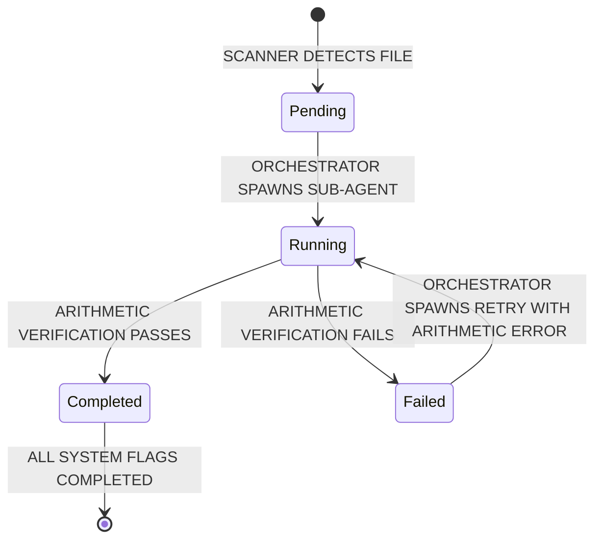

# Blackboard Design Specification

This document defines the structural schema, storage mechanics, state transition guidelines, and verification formulas for the **Blackboard Pattern** state manager in the `financial-analyst-cli` workspace.

---

## 1. Architectural Decision: Single vs. Multiple Blackboards

### The Industry Standard: Context Isolation

In production multi-agent systems, the standard approach is to use **one blackboard per operational boundary (i.e., one per company/ticker)**.

We will implement a **Single Blackboard Per Ticker** pattern (saved as `workspaces/[TICKER]/workspace_state.json`).

#### Why a Unified Shared Blackboard is a Bad Idea:

1. **Context Contamination**: Exposing multiple companies' financials to extraction/modeling agents in a single shared state dramatically increases LLM hallucination rates and prompt token bloat.
2. **File Contention & Locking**: Running autonomous pipelines for multiple companies in parallel would create constant write-lock conflicts if all agents targeted a single global file.
3. **Modular Backup & Portability**: Storing state locally per company allows developers to easily copy, audit, or delete specific company workspaces without corrupting other files.

#### How Cross-Company Queries are Handled (The Read-Only Aggregator):

To support multi-company queries in the future **Interactive Chat Mode** (e.g., _"Which company has the highest organic growth rate?"_), we do not query live, fanned-out JSON blackboards. Instead:

- Individual blackboards remain write-only by their respective pipeline runs.
- At the end of each company run, a lightweight indexer agent crawls the `workspace_state.json` file and synchronizes the flat key metrics into a **global read-only SQLite database** (`workspaces/workspace_index.db`) at the project root.
- The Chat Agent queries this local SQLite database for instant cross-company comparisons.

---

## 2. Complete Pydantic Domain Schema

The Blackboard acts as a structured model matching the exact mathematical steps in [math.py](file:///f:/AIML%20projects/financial-analyst-cli/src/utils/math.py) and [modeler_orchestrator.py](file:///f:/AIML%20projects/financial-analyst-cli/src/agents/modeler_orchestrator.py).

```python
from pydantic import BaseModel, Field
from typing import List, Dict, Optional, Literal

# =====================================================================
# 1. CORE SUPPORTING MODELS & AUDIT TRAILS
# =====================================================================

class AuditLinkage(BaseModel):
    source_file: str
    chunk_id: int
    exact_snippet: str
    extracted_by: str  # e.g., "income_statement_agent"
    timestamp: str

class LineItem(BaseModel):
    line_name: str
    value: float
    operating: bool = True
    calculated: bool = False
    category: Literal[
        "current_assets",
        "noncurrent_assets",
        "current_liabilities",
        "noncurrent_liabilities",
        "income_statement"
    ]
    audit: AuditLinkage

# =====================================================================
# 2. COMPANY METADATA (Ingestion & Setup Properties)
# =====================================================================

class CompanyMetadata(BaseModel):
    """Company-wide constant configurations identified during ingest."""
    ticker: str
    company_name: Optional[str] = None
    description: Optional[str] = None  # Short description of the company business model

    # Fiscal calendar boundary dates
    fiscal_q1_date: Optional[str] = None
    fiscal_q2_date: Optional[str] = None
    fiscal_q3_date: Optional[str] = None
    fiscal_q4_date: Optional[str] = None  # Fiscal year-end date

    # Currency and Unit definitions
    reporting_currency: str = "USD"
    trading_currency: str = "USD"
    preferred_unit: str = "Millions"  # e.g., Thousands, Millions, Billions, 10K
    fx_rate: float = 1.0              # Currency conversion rate from reporting to trading
    adr_ratio: float = 1.0            # ADR conversion multiplier for foreign listings

# =====================================================================
# 3. COMPANY LEVEL DATA (Self-Learning Context & Historical Tables)
# =====================================================================

class AgentExecutionMetrics(BaseModel):
    """Tracks run performance statistics for a specific agent type and document format."""
    total_runs: int = 0
    last_turn_count: int = 0
    average_turn_count: float = 0.0

class ExtractAgentLearning(BaseModel):
    """Specific learnings gathered for a single micro-agent's task to guide future runs."""
    successful_keywords: List[str] = []
    avoid_keywords: List[str] = []
    successful_chunk: List[str] = []
    avoid_chunk: List[str] = []
    metrics: AgentExecutionMetrics = Field(default_factory=AgentExecutionMetrics)

class DocumentTypeLearnings(BaseModel):
    """Micro-agent extract learnings grouped for a specific document format."""
    balance_sheet: ExtractAgentLearning = Field(default_factory=ExtractAgentLearning)
    income_statement: ExtractAgentLearning = Field(default_factory=ExtractAgentLearning)
    diluted_shares: ExtractAgentLearning = Field(default_factory=ExtractAgentLearning)
    organic_growth: ExtractAgentLearning = Field(default_factory=ExtractAgentLearning)
    ebita: ExtractAgentLearning = Field(default_factory=ExtractAgentLearning)
    tax: ExtractAgentLearning = Field(default_factory=ExtractAgentLearning)

class LearningsSchema(BaseModel):
    """Overall self-learning contexts separated by document type to optimize search vectors."""
    annual_filing: DocumentTypeLearnings = Field(default_factory=DocumentTypeLearnings)
    quarterly_filing: DocumentTypeLearnings = Field(default_factory=DocumentTypeLearnings)
    earnings_announcement: DocumentTypeLearnings = Field(default_factory=DocumentTypeLearnings)

class CompanyLevelData(BaseModel):
    learnings: LearningsSchema = Field(default_factory=LearningsSchema)
    # Historical lists storing longitudinal trends and views directly (replacing separate markdown files)
    quarterly_financials: List[Dict[str, Any]] = []
    yearly_financials: List[Dict[str, Any]] = []
    historical_analyst_views: List[Dict[str, Any]] = []

# =====================================================================
# 4. EXTRACTED DATA PER PERIOD (Quarters & Years)
# =====================================================================

class ExtractedFinancialData(BaseModel):
    """Structured financial figures and raw tables extracted per period."""
    # Embedded Markdown representations (preserves visual layout, spacing, lines, and footnotes)
    raw_balance_sheet_markdown: Optional[str] = None
    raw_income_statement_markdown: Optional[str] = None
    raw_notes_markdown: Optional[str] = None  # Dedicated for disclosures explaining identified accounting anomalies or metric spikes/dips (e.g., when orchestrator flags an anomaly and resolves the reason via footnotes)

    # Structured extractions
    line_items: List[LineItem] = []

    # Core Period-Specific Metrics
    revenue: float = 0.0
    operating_income: float = 0.0
    ebita: float = 0.0
    reported_tax_provision: float = 0.0
    adjusted_taxes: float = 0.0
    adjusted_tax_rate: float = 0.21
    basic_shares: float = 0.0
    diluted_shares: float = 0.0
    simple_growth: float = 0.0
    organic_growth: float = 0.0

    # Calculated capital metrics (math.py output)
    net_working_capital: float = 0.0
    net_long_term_operating_assets: float = 0.0
    invested_capital: float = 0.0
    capital_turnover: float = 0.0
    nopat: float = 0.0
    roic: float = 0.0

class AnalystReportExtraction(BaseModel):
    source_file: str
    economic_moat: str
    economic_moat_rationale: str
    margin_outlook: str
    margin_magnitude: str
    margin_rationale: str
    growth_outlook: str
    growth_magnitude: str
    growth_rationale: str
    audit: AuditLinkage

class OtherExtraction(BaseModel):
    source_file: str
    summary: str  # Short summary of the document/release
    audit: AuditLinkage

class ExtractedOtherData(BaseModel):
    """Non-financial statement qualitative extractions."""
    analyst_reports: List[AnalystReportExtraction] = []
    others: List[OtherExtraction] = []

# =====================================================================
# 5. BASE FINANCIAL MODEL PER PERIOD (Valuation & DCF Assumptions)
# =====================================================================

class ModelAssumptions(BaseModel):
    """The DCF inputs and estimations populated by modeling agents."""
    wacc: float = 0.09
    capital_turnover: float = 1.0
    revenue_growth_rate: float = 0.05
    margin_yr5: float = 0.15
    terminal_margin: float = 0.15
    terminal_growth_rate: float = 0.03
    adjusted_tax_rate: float = 0.21

    # Non-operating bridge categories (latest Balance Sheet values)
    excess_cash: float = 0.0
    short_term_investments: float = 0.0
    debt: float = 0.0
    preferred_equity: float = 0.0
    minority_interest: float = 0.0
    other_financial_assets_net: float = 0.0
    net_debt: float = 0.0

    # Capital structure inputs
    shares_outstanding: float = 0.0
    share_price: float = 0.0
    market_cap: float = 0.0

class DCFProjectionYear(BaseModel):
    """A single projected year's financials (Years 1-10)."""
    year: int
    revenue: float
    growth: float
    ebita: float
    margin: float
    nopat: float
    reinvestment: float
    invested_capital: float
    roic: float
    fcf: float
    discount_factor: float
    present_value: float

class BaseFinancialModel(BaseModel):
    """Base financial model and WACC/DCF calculations generated for the period."""
    assumptions: ModelAssumptions
    projections: List[DCFProjectionYear] = []

    # Valuation Output
    calculated_intrinsic_value_per_share: float = 0.0
    calculated_equity_value: float = 0.0
    calculated_enterprise_value: float = 0.0
    upside_downside_percentage: str = "N/A"
    dcf_run_date: str

# =====================================================================
# 6. ROOT WORKSPACE STATE (The Temporal Blackboard Container)
# =====================================================================

class TemporalBlackboard(BaseModel):
    """All data and status flags for a single period (Quarter or Year)."""
    fiscal_year: int # can only be 4 digit year
    fiscal_period: str  # can only be "Q1", "Q2", "Q3", "Q4", "FY"
    is_quarterly: bool
    source_file: str

    # Status Flags (check-out / check-in lock mechanism to prevent duplicate agent execution)
    balance_sheet_status: Literal["pending", "running", "completed", "failed"] = "pending"
    income_statement_status: Literal["pending", "running", "completed", "failed"] = "pending"
    shares_status: Literal["pending", "running", "completed", "failed"] = "pending"
    organic_growth_status: Literal["pending", "running", "completed", "failed"] = "pending"
    ebita_status: Literal["pending", "running", "completed", "failed"] = "pending"
    tax_status: Literal["pending", "running", "completed", "failed"] = "pending"
    modeling_status: Literal["pending", "running", "completed", "failed"] = "pending"

    # Structured Contents
    financial_data: ExtractedFinancialData
    other_data: ExtractedOtherData
    base_model: Optional[BaseFinancialModel] = None

    # Error audit trail specific to this period
    arithmetic_errors: List[str] = []

class WorkspaceContext(BaseModel):
    """The root Blackboard schema stored inside workspaces/[TICKER]/workspace_state.json."""
    metadata: CompanyMetadata
    company_data: CompanyLevelData
    reports: Dict[str, TemporalBlackboard] = {}  # Keyed by period (e.g., "2024_Q3")
```

---

## 3. Scenario Models: Kept Outside the Blackboard

### Architecture Separation

While the **Base Financial Model** (representing the standard estimates derived by the pipeline agents) is stored directly on the blackboard per period, **Scenario Models** must reside **completely outside the Blackboard**:

- **Why**: The blackboard is the shared state of the _autonomous pipeline_. If users run ad-hoc sensitivity checks, change margins, or tweak growth rates using the Interactive Web Viewer, saving these dynamic iterations to the main `workspace_state.json` would contaminate the base pipeline state and disrupt autonomous agents.
- **Where**: Scenario models are stored locally inside the web viewer's storage (e.g. browser `localStorage` or a dedicated viewer server directory `workspaces/[TICKER]/9_scenario_model_json/`).
- **Structure**: Each scenario stores a delta of modified assumptions (e.g., `{"scenario_name": "Bull Case", "wacc": 0.08, "margin_yr5": 0.18}`) and the resulting calculations, referencing the parent `base_model` version.

---

## 4. Mathematical Verification & Reconciliation Logic

The **Blackboard Orchestrator** triggers programmatic validation checks. If any of the following validation formulas fail on fanned-in data, the Orchestrator will prompt the user on the CLI to choose whether to proceed or retry.

### Rule 1: Balance Sheet Consistency (Double-Entry Match)

The sum of operating and non-operating assets must equal liabilities and equity:
$$\text{Total Assets} = \text{Total Liabilities} + \text{Total Equity}$$

- **Verification Rule**:
  ```python
  total_assets = sum(item.value for item in report.financial_data.line_items if "assets" in item.category)
  total_liabilities_equity = sum(item.value for item in report.financial_data.line_items if "liabilities" in item.category or item.category == "equity")
  if abs(total_assets - total_liabilities_equity) > 1.0:
      report.balance_sheet_status = "failed"
      report.arithmetic_errors.append(f"Balance sheet mismatch: Assets ({total_assets}) != Liab+Eq ({total_liabilities_equity})")
  ```

### Rule 2: Invested Capital Derivation (math.py Verification)

Invested capital is calculated from operating categories. The Blackboard verifies:
$$\text{Invested Capital} = (\text{Operating Current Assets} - \text{Operating Current Liabilities}) + (\text{Operating Non-Current Assets} - \text{Operating Non-Current Liabilities})$$

- **Verification Rule**:

  ```python
  oca = sum(item.value for item in report.financial_data.line_items if item.category == "current_assets" and item.operating)
  ocl = sum(item.value for item in report.financial_data.line_items if item.category == "current_liabilities" and item.operating)
  onca = sum(item.value for item in report.financial_data.line_items if item.category == "noncurrent_assets" and item.operating)
  oncl = sum(item.value for item in report.financial_data.line_items if item.category == "noncurrent_liabilities" and item.operating)

  nwc = oca - ocl
  nltoa = onca - oncl
  expected_ic = nwc + nltoa
  if abs(report.financial_data.invested_capital - expected_ic) > 1.0:
      report.arithmetic_errors.append(f"Invested Capital mismatch: calculated expected {expected_ic}, found {report.financial_data.invested_capital}")
  ```

### Rule 3: Income Statement Consistency

The sub-totals extracted by the agents must sum to reported items:
$$\text{Revenue} - \text{Cost of Goods Sold} - \text{SG&A Expense} - \text{R&D Expense} = \text{Operating Income}$$
If the sub-totals mismatch the reported `operating_income` or `revenue` values, the extraction is marked `failed` and rescheduled.

---

## 5. Storage & State Lifecycle



### Persistence & Concurrency Policy

1. **At Turn Entry**: Read `workspace_state.json` from disk.
2. **At Turn Tool Execution**: Micro-agents query the file, perform their task, check out and modify their specific status flags and target data segment, and write the state back to `workspace_state.json` immediately.
3. **On Completion**: If fanned-in status flags of a `TemporalBlackboard` are completed, the Orchestrator can trigger the `CuratorAgent` at discretionary intervals (either explicitly requested by the user or once per quarter) to curate final summaries in the Ticker's Wiki markdown files. The `LearningAgent` is called at the Orchestrator's discretion (e.g. when a sub-agent takes a long time or encounters a failure milestone).

### Check-Out / Check-In Lock Mechanism

To prevent duplicate execution and coordinate parallel runs (enabling safe concurrency and preventing context contamination):

- **Check-Out (Locking)**: When a sub-agent starts, it executes a deterministic check-out script that inspects and sets its specific task flag on the blackboard to `running`. This locks the small target piece of the blackboard.
- **Check-In (Unlocking)**: When the sub-agent template finalizes its task, it executes a deterministic check-in script that writes its structured output, transitions the task flag to `completed` (or `failed`), and unlocks the state by saving the changes back to `workspace_state.json`.
- **Wiki Lock**: The `CuratorAgent` uses a check-in / check-out locking mechanism for `[TICKER]_wiki.md` to prevent any write collisions when compiling qualitative insights from the blackboard.

---

## 6. Outstanding Concurrency & Fault-Tolerance Decisions

Since the Orchestrator runs sub-agents concurrently via `asyncio`, the following design decisions remain outstanding and must be finalized:

1. **Blocking Gates**:
   - What are the precise execution gates? Which agents/processes must complete successfully before downstream agents are allowed to start (e.g., ingestion -> extraction, extraction tier 1 -> tier 2, extraction -> model)?
2. **Asynchronous Failure and Reconciliation Queue**:
   - What happens to other concurrently running agents when a single agent fails or a math reconciliation check fails?
   - We need to design a prompt failure queue to process failed cases in order, allowing the user to inspect, retry, override, or proceed.
   - We must also provide a "stop all agents" option to immediately terminate all running and queued tasks.
