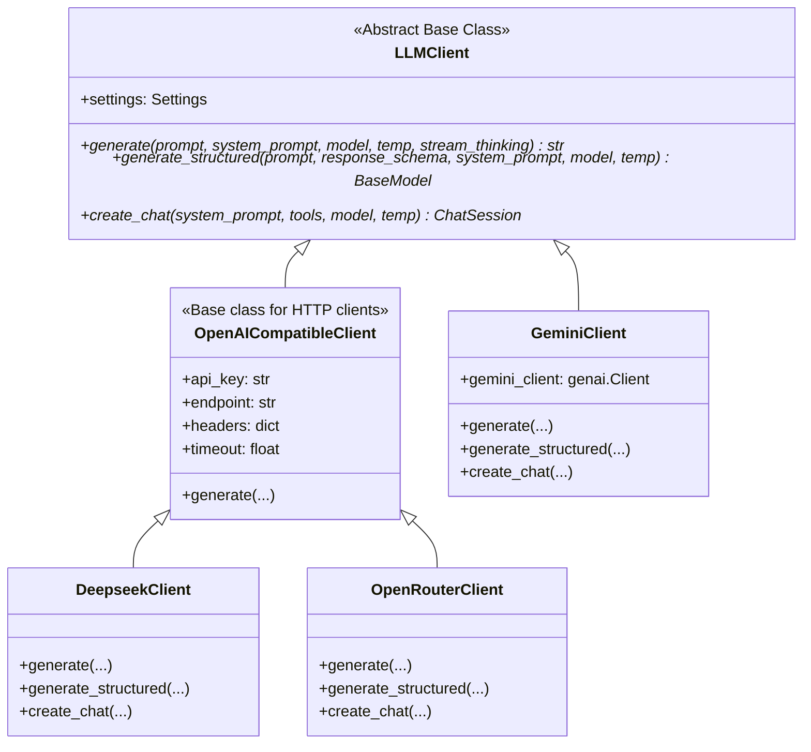

# Refactoring Design: Unified LLM Client with Explicit Subclasses and Factory

This document specifies the target architecture, class structure, and implementation plan for refactoring the LLM services in `financial-analyst-cli`.

Our goal is to leverage Google's native Gemini API features (via the official `google-genai` SDK) while fully retaining the capability to use DeepSeek and OpenRouter. We achieve this by introducing an explicit class inheritance hierarchy with an abstract base class, and utilizing a module-level factory function to instantiate the correct client.

Additionally, this refactor will **completely eliminate the monolithic, fragile streaming & JSON parsing loops** currently in `llm_client.py` by delegating these responsibilities cleanly to the concrete subclasses.

---

## 1. Class Structure & Inheritance

We will rewrite `src/services/llm_client.py` to organize providers cleanly, separating the native SDK client from the HTTP/OpenAI-compatible clients.



### A. The Abstract Base Class (`LLMClient`)

```python
from abc import ABC, abstractmethod
from pydantic import BaseModel
from typing import Type, TypeVar

T = TypeVar("T", bound=BaseModel)

class LLMClient(ABC):
    def __init__(self, settings):
        self.settings = settings

    @abstractmethod
    def generate(
        self,
        prompt: str | list,
        system_prompt: str = None,
        model: str = None,
        temperature: float = 0.1,
        stream_thinking: bool = True,
    ) -> str:
        """Classic text-in, text-out generation."""
        pass

    @abstractmethod
    def generate_structured(
        self,
        prompt: str | list,
        response_schema: Type[T],
        system_prompt: str = None,
        model: str = None,
        temperature: float = 0.1,
    ) -> T:
        """Generates structured output validated against a Pydantic schema."""
        pass

    @abstractmethod
    def create_chat(
        self,
        system_prompt: str = None,
        tools: list = None,
        model: str = None,
        temperature: float = 0.1,
    ) -> "ChatSession":
        """Creates a stateful ChatSession for multi-turn interactions."""
        pass
```

### B. The Factory Function (`get_llm_client`)

A clean module-level function will read settings and instantiate the correct subclass:

```python
def get_llm_client() -> LLMClient:
    from src.core.config import load_config
    settings = load_config()
    provider = getattr(settings, "api_provider", "openrouter").lower()

    if provider == "gemini":
        return GeminiClient(settings)
    elif provider == "deepseek":
        return DeepseekClient(settings)
    else:
        return OpenRouterClient(settings)
```

---

## 2. Decoupled Streaming & Parsing Implementation

Previously, `llm_client.py` contained a single, massive `generate` method that manually split content by searching for `"<think>"` strings, checking if thinking blocks had started or ended, and dynamically buffering chunks.

We will completely eliminate this monolithic approach.

### A. `GeminiClient` (Native SDK Streaming)
The Gemini client will use the official `google-genai` SDK's streaming features, which automatically separate code execution, function calling, and text content without manual string token splitting:
```python
def generate(self, prompt, system_prompt=None, model=None, temperature=0.1, stream_thinking=True):
    # Gemini SDK handles reasoning/content routing automatically under the hood.
    # We simply iterate over the response stream and print tokens cleanly.
    config = types.GenerateContentConfig(
        system_instruction=system_prompt,
        temperature=temperature
    )
    if stream_thinking:
        response = self.gemini_client.models.generate_content_stream(
            model=model or "gemini-2.5-flash",
            contents=prompt,
            config=config
        )
        full_text = []
        for chunk in response:
            print(chunk.text, end="", flush=True)
            full_text.append(chunk.text)
        print()
        return "".join(full_text)
    else:
        response = self.gemini_client.models.generate_content(...)
        return response.text
```

### B. `DeepseekClient` (API-Native Reasoning Streaming)
The DeepSeek API natively exposes reasoning tokens via the `reasoning_content` field in the stream delta, removing the need for `"<think>"` string parsing:
```python
# In DeepseekClient.generate() with stream_thinking=True
# We check chunk["choices"][0]["delta"].get("reasoning_content") and print it in a dim style.
# We then print delta.get("content") normally when it arrives.
for line in response.iter_lines():
    # ...
    delta = chunk["choices"][0]["delta"]
    reasoning = delta.get("reasoning_content")
    content = delta.get("content")

    if reasoning:
        if not started_thinking:
            print("Sir Pennyworth is pondering... ", end="", flush=True)
            started_thinking = True
        print(reasoning, end="", flush=True)

    if content:
        if started_thinking:
            print() # line break after thinking ends
            started_thinking = False
        print(content, end="", flush=True)
```

### C. `OpenRouterClient` (Fallback / General Streaming)
For OpenRouter, reasoning tokens are streamed in the delta's `reasoning` field or as part of `choices[0].delta.get("content")` depending on the model. We can handle OpenRouter-specific headers and stream fields directly here:
```python
# In OpenRouterClient.generate()
# OpenRouter reasoning is fetched via delta.get("reasoning")
reasoning = delta.get("reasoning")
content = delta.get("content")
```

### D. Eliminating Legacy Regex JSON Parsing
By migrating agent extraction tasks to `generate_structured(response_schema=MyPydanticModel)`, we move all regex/partial JSON extraction out of the agent loops.
- In `GeminiClient`, schema enforcement is handled by Gemini's native API.
- In `OpenAICompatibleClient`, the schema validation/regex extraction is cleanly encapsulated inside `generate_structured` and doesn't pollute standard text generation or agent loops.

---

## 3. Chat Session Abstractions

```python
class ChatSession(ABC):
    @abstractmethod
    def send_message(self, message: str) -> str:
        """Sends a message and returns response text."""
        pass

    @abstractmethod
    def get_history(self) -> list[dict]:
        """Gets message history in standard OpenAI message list format."""
        pass
```

- **`GeminiChatSession(ChatSession)`**: Wraps native stateful chats from the SDK.
- **`SimulatedChatSession(ChatSession)`**: Manages a local list of messages and delegates back to `client.generate()` at each step.

---

## 4. Updates Required in the Codebase

All files instantiating `LLMClient()` will be updated to import and use `get_llm_client()`.

### Files to Update:
1. **[modeler_orchestrator.py](file:///f:/AIML%20projects/financial-analyst-cli/src/pipeline/modeler_orchestrator.py)**:
   - Replace `from src.services.llm_client import LLMClient` and `LLMClient()` with `get_llm_client()`.
2. **[ingester.py](file:///f:/AIML%20projects/financial-analyst-cli/src/pipeline/ingester.py)**:
   - Replace instantiations of `LLMClient()`.
3. **[indexer_agent.py](file:///f:/AIML%20projects/financial-analyst-cli/src/pipeline/indexer_agent.py)**:
   - Replace instantiations of `LLMClient()`.
4. **[extractor_orchestrator.py](file:///f:/AIML%20projects/financial-analyst-cli/src/pipeline/extractor_orchestrator.py)**:
   - Replace instantiations of `LLMClient()`.
5. **[curator_agent.py](file:///f:/AIML%20projects/financial-analyst-cli/src/pipeline/curator_agent.py)**:
   - Replace instantiations of `LLMClient()`.
6. **[chat.py](file:///f:/AIML%20projects/financial-analyst-cli/src/cli/commands/chat.py)**:
   - Replace instantiations of `LLMClient()`.

---

## 5. Testing & Verification

- **Mocking**: Update unit tests to mock `src.services.llm_client.get_llm_client` to return a mock client instead of patching `LLMClient`.
- **Individual Unit Tests**: Introduce a test file `tests/test_llm_clients.py` that checks:
  1. `get_llm_client()` instantiates the correct subclass based on config.
  2. Mocked standard generation, structured output generation, and chat sessions work as expected for all 3 subclasses.
