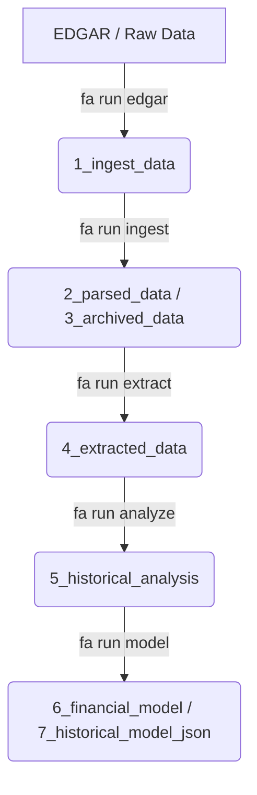

# Requirements Specification: Financial Analyst CLI

This document outlines the product requirements and technical specifications for the Financial Analyst CLI (`fa`). It defines the system behavior, LLM personas, processing pipelines, and local analysis workflows.

---

## 1. System Identity & LLM Persona
The CLI is hosted by **Sir Pennyworth**, a senior financial analyst persona. All system prompts directed to the LLM must enforce this persona:
- **Senior Financial Analyst Expertise**: Displays deep expertise in corporate finance, valuation, accounting, and security analysis.
- **Tone**: Sophisticated, polite, precise, and analytical, with a touch of pig/wealth puns (e.g., "truffle-hunting for value").
- **Accuracy**: Extremely rigorous with numbers. Ensures metrics are double-checked and structured neatly.

---

## 2. Configuration & Workspace Setup

### 2.1 First-Time Configuration Flow
When the CLI is executed for the first time (or if configuration is missing), it guides the user through the initialization:
1. **User Identity**: Prompt for **Full Name**, **Email Address**, and **Project Name**.
   > [!IMPORTANT]
   > This information is required for user-agent headers when accessing the SEC EDGAR API. Fake information may lead to connection blocks or API access failures.
2. **LLM API Credentials**: Prompt for at least one API Key (e.g., OpenRouter, Gemini, OpenAI, Anthropic, Fireworks AI).
3. **Model Selection**:
   - The user must configure:
     - A **text-to-text model** (e.g., `google/gemma-4-31b-it:free`).
     - A **vision-to-text model** (for charts/tables).
   - *Alternative*: Option to use a unified multimodal model (e.g., **Gemma**) natively for both text and vision tasks.
4. **Workspace Path**: Prompt for the location of the active workspace.
   > [!IMPORTANT]
   > Each workspace must contain data for exactly **one company** to avoid context bloat. The workspace directory should be named after the company's ticker symbol (e.g., `AAPL` or `MSFT`).
5. **Workspace Switcher (`fa use <ticker>`)**:
   - The CLI must support switching between different company workspaces dynamically.
   - When the user runs `fa use <ticker>`, the system updates the active workspace path in the configuration, initializes the directories if they don't exist, and loads the corresponding self-healing company contexts.

### 2.2 Workspace Directory Structure
When a workspace path is set or initialized, the CLI automatically verifies and creates the following subfolders:
- `1_ingest_data/`: Raw downloaded documents (PDFs, HTML filings, press releases).
- `2_parsed_data/`: Parsed files converted to markdown format.
- `3_archived_data/`: Archived original raw files.
- `4_extracted_data/`: Extracted metrics and summaries of individual documents.
- `5_historical_analysis/`: Longitudinal historical models and qualitative trends.
- `6_financial_model/`: Markdown representations of projected DCF valuation models.
- `7_historical_model_json/`: JSON model versions for the interactive web viewer.
- Root wiki/learning files (`[TICKER]_wiki.md`, `[TICKER]_extract_learning.md`, `[TICKER]_analyze_learning.md`, `[TICKER]_model_learning.md`): Continuously refined via the Curator Agent.

---

## 3. Core Workflow Pipeline

### 3.1 Step 1: Data Fetching (`fa run edgar`)
- **Action**: Fetch financial filings using the SEC EDGAR API.
- **Parameters**: Ticker symbol and time period (restricted to a maximum of **5 years in the past**).
- **Output**: Downloads all `10-K`, `10-Q`, and `20-F` filings for the period into `1_ingest_data/`.

### 3.2 Step 2: Ingestion (`fa run ingest`)
- **Queue & Retries**: Processes files in `1_ingest_data/` one-by-one. Utilizes a deterministic queue to prevent race conditions. Implements robust exponential back-off and retry logic. *Do not rely on the LLM to manage the queue.*
- **Step 2A: Hash Verification**:
  - Deterministically hash each file and compare it to the hashes in `parsed_data.csv`.
  - If a duplicate hash is found, skip the file.
  - If new, append a new entry to `parsed_data.csv` with placeholders for `new_filename`, `document_type`, `document_date`, and `fiscal_quarter`.
- **Step 2B: Conversion**:
  - Convert PDFs or HTML to markdown. The parsing script must maintain the alignment, spaces, and lines of financial tables.
  - Write markdown to `2_parsed_data/` and move the original raw file to `3_archived_data/`.
- **Step 2C: Chunking & Metadata Prepending**:
  - Split the markdown file into **5,000-character chunks**.
  - Create a summary table of the chunk distribution: `chunk_id`, character range (`char X to Y`), frequency of numbers, and frequency of symbols.
  - Prepend this summary table and document metadata as **`chunk_id=0`** to the markdown file. `chunk_id=1` will contain the first 5,000 characters of the document body.
- **Step 2D: LLM Identification**:
  - Prompt the LLM with `document_types.json`, `ingest_context.md`, and the current entry in `parsed_data.csv`.
  - The LLM identifies the true document date and type.
  - *Note*: Filing dates are often 30-60 days after the actual quarter/fiscal period end.
  - If the document is a `10-Q`, `10-K`, or `earnings_announcement`, the LLM also identifies the fiscal quarter.
  - Rename the markdown and raw files to `YYYYMMDD_document_type.md` (and corresponding raw extension) using the identified document date, and update `parsed_data.csv`.
- **Step 2E: Self-Healing Ingestion Context**:
  - The Curator Agent compiles details and updates `[TICKER]_extract_learning.md` and `[TICKER]_wiki.md` in the root with identified company details:
    - Fiscal year-end month and the mapping of calendar months to fiscal quarters.
    - Company-specific formatting preferences.
  - Verify and correct fiscal quarter/document date mappings retroactively.

### 3.3 Step 3: Metric Extraction (`fa run extract`)
- **Queue**: Compare files in `2_parsed_data/` against `4_extracted_data/` registries and queue unprocessed files.
- **Step 3A: Chunk-Based Extraction**:
  - The LLM examines the prepended table in `chunk_id=0` to locate relevant sections.
  - The LLM pulls chunks one-by-one. For each chunk accessed, it appends a 1-2 sentence summary of that chunk to `YYYYMMDD_filetype_extracted.md` along with the `chunk_id`.
- **Step 3B: Task-Specific Extraction & Agents**:
  - **`analyst_report`**: Processes analyst reports via the **Analyst Report Agent** (a multi-turn agent with a maximum of 5 turns) that locates discussions on economic moat, margin outlook, and organic growth outlook, compiles qualitative trends, and verifies source citations.
  - **`press_release` / `news_article` / `other`**: Concise summary of what is different, unusual, or special.
  - **`transcript`**: Focus on analyst questions, management guidance, and non-mundane developments.
  - **`10-Q` / `10-K` / `20-F` / `earnings_announcement`**: Utilizes dedicated agents to extract core financial statements:
    - **Income Statement Agent**: Locates and extracts the complete Income Statement. Ensures standard sign representation (expenses/reductions are negative, additions/gains are positive) guided by `src/resources/dictionary/income_statement.md`.
    - **Balance Sheet Agent**: Locates and extracts the complete Balance Sheet.
    - **Quality Checks**: Employs programmatic LLM validators (`check_income_statement_quality` and `check_balance_sheet_quality`) to verify that subtotals match raw line items and Assets = Liabilities + Equity before finalizing.
    - **Traceability and Audit Linkage**: For every extracted financial figure, the agents record metadata containing `source_file`, `chunk_id`, and `exact_snippet` for full auditing.
- **Step 3C: Interpretation & Advanced Agents**:
  - **Financial Statement Interpretation Agent**: Review and audit extracted statements to:
    - Classify line items as raw primitive lines or `calculated` subtotals/totals (inferring mathematical hierarchy from indentation, placement, and sums).
    - Classify lines as **operating** (core activities) vs **non-operating** (financing, investing, taxes), respecting local dictionaries and manual user feedback.
    - Standardize positive/negative signs across all lines to maintain mathematical consistency.
  - **Diluted Shares Outstanding Agent**: Executes a targeted, low-latency 4-turn search utilizing keyword context to locate exact basic and diluted shares outstanding for the periods.
  - **Organic Growth Agent**: Locates organic revenue growth figures, constant currency (CC) adjustments, and M&A contributions; computes the organic growth rate if not explicitly reported.
  - **Operating EBITA Agent**: Identifies non-recurring adjustments (restructuring, amortization, impairment, write-offs) in footnotes and backs them out to compute clean Operating EBITA.
  - **Adjusted Taxes Agent**: Backs out the tax effects of non-operating adjustments at a standard statutory tax rate (25%) and reviews footnotes for non-recurring tax benefits.
  - **Rust Performance Boundary**: Passes the Pydantic-validated JSON of classified items to the **Rust Core Engine** to calculate Invested Capital, NOPAT, ROIC, and Capital Turnover. All calculated metrics propagate the audit linkage metadata back to their respective raw source numbers.
- **Step 3D: Manual User Extraction Context**:
  - The file `[TICKER]_extract_learning.md` in the root is used to provide manual user feedback to override/configure custom classifications for operating/non-operating items under the `## User Feedback` section. The Curator Agent reads and rewrites/compacts this feedback into lessons and clears the feedback section.

### 3.4 Step 4: Historical Analysis (`fa run analyze`)
- **Queue**: Identify files in `4_extracted_data/` not yet integrated into `5_historical_analysis/`.
- **Processing Tasks**:
  - **`analyst_report`**: Update `5_historical_analysis/analyst_views.md`. Track changes in moat, margins, and growth trajectory using a structured table. Keep comments concise and focus on the overall synthesis.
  - **`press_release` / `news_article` / `other`**: Update `5_historical_analysis/news_trend.md`. Surface contradictions or major trends.
  - **`transcript`**: Update `5_historical_analysis/transcript_trend.md`. Track themes in analyst inquiries.
  - **`10-Q` / `earnings_announcement`**: Update `5_historical_analysis/financials_quarter.md` (quarterly metrics).
  - **`10-K` / `20-F`**: Update `5_historical_analysis/financials_annual.md` (annual metrics).
- **Self-Healing Integration**:
  - If annual reports are processed, the LLM checks if it can deduce a missing fourth quarter's financials by subtracting the first three quarters from the annual total, and writes the calculated Q4 metrics to `financials_quarter.md`.
  - At the end of the analysis stage, the Curator Agent runs to consolidate qualitative views into `[TICKER]_wiki.md` and historical trend lessons into `[TICKER]_analyze_learning.md`, clearing the feedback section.

### 3.5 Step 5: Financial Modeling (`fa run model`)
- **Step 5A: Base Assumption Derivation & Modeler Agents**:
  - Run deterministic calculations to determine default values for: `base_WACC`, `base_capital_turnover`, `base_revenue`, `base_ebita_margin`, `base_adjusted_tax_rate`, `base_growth_rate`, and `base_terminal_growth`.
  - Delegate assumption estimation to specialized multi-turn agents orchestrated by `modeler_orchestrator.py`:
    - **WACC Agent**: A 4-turn agent that delevers and relevers the beta using a full corporate finance WACC formula, finding and pulling necessary values via helper tools. It writes WACC calculations to the model markdown and triggers curator updates under `## WACC` in `[TICKER]_model_learning.md`.
    - **Growth Agent**: A 4-turn agent that proposes near-term, mid-term, and terminal growth rates with rationales, curating results under `## Growth` in `[TICKER]_model_learning.md`.
    - **Margin Agent**: A 4-turn agent that estimates three future margins (base, Year 5 target, and terminal) with rationale, curating lessons under `## Margin` in `[TICKER]_model_learning.md`.
    - **Non-Operating Agent**: A single-turn agent that extracts 6 non-operating categories from the latest balance sheet to replace net debt.
- **Step 5B: LLM Estimation & Inputs**:
  - Use `analyst_views.md`, `financials_quarter.md`, and `financials_annual.md` as initial context.
  - Determine `shares_outstanding` from the latest quarter's basic or diluted shares outstanding (the most recent period containing a number).
- **Step 5C: User Validation & Self-Healing**:
  - Present the assumptions table to the user for feedback.
  - Record any overrides or adjustments in `[TICKER]_model_learning.md`.
- **Step 5D: Execution**:
  - Generate the projected financial model. Output the readable markdown file to `6_financial_model/` and the structured JSON to `7_historical_model_json/` as `YYYYMMDD_ticker_0.json`.

---

## 4. Commands & User Interface

### 4.1 CLI Commands
- `fa run edgar`: Fetch filings from SEC EDGAR.
- `fa run ingest`: Parse and ingest files from `1_ingest_data/`.
- `fa run extract`: Extract statements and key metrics.
- `fa run analyze`: Update longitudinal analysis files.
- `fa run model`: Propose and generate valuation models.
- `fa chat <ticker>`: Open an interactive analyst shell/REPL with Sir Pennyworth, enabling ad-hoc queries, direct statement auditing, and manual model updates.
- `fa query summary <ticker>` / `assessment <ticker>` / `valuation <ticker>`: Query tables.
- `fa query trace <ticker> <metric> <period>`: Retrieve the audit trail (file, chunk, exact text snippet) for any compiled metrics.
- `fa use <ticker>`: Dynamically switch the current active workspace to the folder for the specified company ticker.
- `fa viewer`: Start the local interactive HTML viewer server.
- `fa config init` / `show`: Handle environment keys, model configurations, and workspace settings.

### 4.2 Local HTML Viewer
- Zero-dependency DCF HTML application.
- Loads JSON files from `7_historical_model_json/`.
- Allows modifying assumptions (e.g., tax rate, WACC, growth) in the browser, recalculating cash flows and intrinsic value in real time, and saving the new model back as `YYYYMMDD_ticker_1.json`, etc.

---

## 5. Tools Available to the CLI Agent
To manage files and perform context-aware tasks, the CLI agent has access to:
- **Term Search**: Returns a JSON of matches with 200 characters of surrounding context.
- **Markdown Mutators**: Prepend, append, or insert text blocks.
- **CSV Mutators**: Prepend, append, or insert rows.
- **Chunk Retrieval**: Extract a specific character-bound chunk ID. *Never pass full raw filings directly to the LLM context.*
- **Operating Classification Helper**: Searches the central dictionary in `src/resources/dictionary/` (structured with an `index.md` listing all line items, and individual markdown files for each line item defining its accounting definition and valuation treatment). If not found locally, falls back to web searches (specifically Investopedia) using the established `duckduckgo-search` library to classify operating vs non-operating line items.
- **Dynamic Math Expression Solver**: A sandboxed execution environment built using `RestrictedPython` or `SymPy` (for symbolic math parsing) that allows the agent to safely execute mathematical Python expressions to solve custom calculations requested by the user during interactive chat sessions, avoiding remote code execution (RCE) vulnerabilities.
- **Terminal Monitor & Error-Feedback Hook**: Captures stdout/stderr from executing code and formats traceback errors to feed back into the agent context, enabling Sir Pennyworth to self-correct and debug his own formulas/queries.
- **Execution Timer & Timeout Watchdog**: Monitors running tasks and enforces execution timers (e.g. 5-second limits on mathematical calculations) to prevent hung processes, infinite loops, or resource starvation.
- **Workspace & System Audit Tool**: Queries active file systems, local port allocations (e.g. checking if port `3000` for the viewer is already bound), and system credentials to verify workspace readiness.
